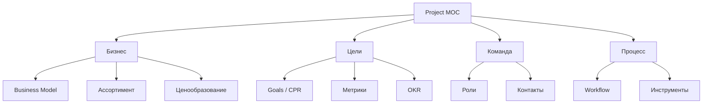

# 🔍 MOC Project

> **MOC (Map of Content)** — указатель по разделу проекта

---

## 📂 Структура

---

## 📄 Страницы раздела

### Бизнес
- [[Business-Model]] — двойная бизнес-модель: производство + турагентство
- [[Assortment]] — описание всех 6 SKU
- [[Pricing]] — ценовая политика
- [[Geography]] — география и логистика

### Цели
- [[Goals]] — цели, KPI, метрики успеха
- [[Success-Criteria]] — критерии успеха проекта

### Команда
- [[Team-Roles]] — кто за что отвечает
- [[Stakeholders]] — стейкхолдеры

---

## 🔗 Связанные MOC

- [[../02-Audit/MOC-Audit|Аудит]]
- [[../03-Research/MOC-Research|Исследования]]
- [[../06-Design/MOC-Design|Дизайн]]
- [[../09-Decisions/MOC-Decisions|Решения]]

---

[[../README|⬅ На главную]]