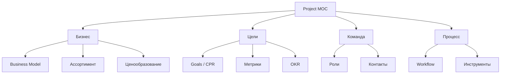

# 🔍 MOC Project

> **MOC (Map of Content)** — указатель по разделу проекта

---

## 📂 Структура

---

## 📄 Страницы раздела

### Бизнес
- [Business-Model](Business-Model.md) — двойная бизнес-модель: производство + турагентство
- [Assortment](Assortment.md) — описание всех 6 SKU
- [Pricing](Pricing.md) — ценовая политика
- [Geography](Geography.md) — география и логистика

### Цели
- [Goals](Goals.md) — цели, KPI, метрики успеха
- [Success-Criteria](Success-Criteria.md) — критерии успеха проекта

### Команда
- [Team-Roles](Team-Roles.md) — кто за что отвечает
- [Stakeholders](Stakeholders.md) — стейкхолдеры

---

## 🔗 Связанные MOC

- [Аудит](../02-Audit/MOC-Audit.md)
- [Исследования](../03-Research/MOC-Research.md)
- [Дизайн](../06-Design/MOC-Design.md)
- [Решения](../09-Decisions/MOC-Decisions.md)

---

[⬅ На главную](../00-Inbox/README.md)