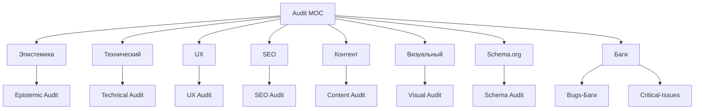

# 🔍 MOC Audit (обновлено)

> **MOC** раздела аудита. Содержит все виды проверок текущего сайта. Обновлено после эпистемического аудита 26.06.2026.

---

## 📂 Структура

---

## 📄 Страницы раздела

### Коррекция
- [[Epistemic-Audit]] — **НОВОЕ**: проверка всех чисел и фактов исследования

### Все виды аудита
- [[Technical-Audit]] — стек, плагины, производительность
- [[UX-Audit]] — навигация, кнопки, формы, поток покупки
- [[SEO-Audit]] — мета-теги, h1-h6, alt, перелинковка
- [[Content-Audit]] — описания, тексты, медиа
- [[Visual-Audit]] — дизайн, цвета, типографика, логотип
- [[Schema-Audit]] — JSON-LD, микроразметка

### Проблемы
- [[Bugs-Баги]] — единый список багов по приоритету (обновлено: 26 багов)
- [[Critical-Issues]] — критические (обновлено)

---

## 📊 Сводная таблица (обновлено)

| Категория | Статус | Критичность | Изменение после аудита |
|---|---|---|---|
| Эпистемика | ✅ Проверено | — | 🆕 новый раздел |
| Технический | ⚠️ Частично | 🟡 средняя | — |
| UX | 🔴 Плохо | 🔴 высокая | — |
| SEO | 🔴 Плохо | 🔴 высокая | — |
| Контент | 🟡 Средне | 🟡 средняя | ⬆️ улучшено (109 отзывов) |
| Визуальный | 🟡 Нейтрально | 🟡 средняя | — |
| Schema.org | ⚠️ Частично | 🟡 средняя | ⬆️ улучшено (главный товар ОК) |
| Баги | 🔴 26 штук | 🔴 высокая | ⬆️ +2 новых |

---

## 🎯 Скоринг (обновлено)

| Критерий | Было | Стало | Изменение | Комментарий |
|---|---|---|---|---|
| Техническая работоспособность | 7/10 | 7/10 | = | WP+WWC работает |
| SEO-оптимизация | 2/10 | 2/10 | = | Спам keywords, пустые meta |
| UX | 3/10 | 3/10 | = | Навигация бедная |
| **Качество контента** | **1/10** | **5/10** | ⬆️ **+4** | 109 отзывов, 4 из 6 описаны |
| Визуальная привлекательность | 4/10 | 4/10 | = | Bono-шаблон |
| **Конверсионная архитектура** | **2/10** | **3/10** | ⬆️ **+1** | Schema у главного товара |
| **Общий скор** | **3.2/10** | **4.7/10** | ⬆️ **+1.5** | Улучшено |

---

## 🔗 Связанные MOC

- [[../01-Project/MOC-Project|Project]]
- [[../03-Research/MOC-Research|Research]]
- [[../07-Technical/MOC-Tech|Technical backlog]]
- [[../09-Decisions/MOC-Decisions|Decisions]]

---

[[../README|⬅ Главная]]