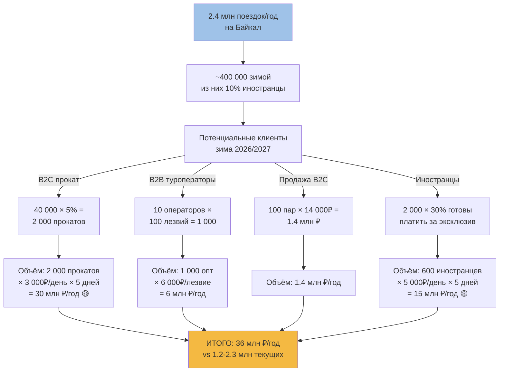

# 🌍 Байкальский и зарубежный рынок байсов

> Диалектическое расширение [[Research-Plan]]: что мы НЕ исследовали в первом заходе и почему это важно для ГРОМ.

**Дата:** 01.07.2026
**Метод:** Chrome DevTools + открытые источники (Wikipedia, Google AI Overview, брендовые сайты)

---

## 🧠 Диалектический разбор

### Тезис
Первый research-заход (см. [[Research-Plan]]) исследовал **российский B2C-рынок байсов**:
- Wordstat: 44–91 запрос/мес
- Авито: 58 объявлений по РФ
- Цены: 4 300–16 000 ₽
- Конкуренты: Zandstra, самодельные мастера
- Реалистичная оценка: 100–300 пар/год на весь российский рынок

**Вывод:** российский B2C — микро-ниша.

### Антитезис
ГРОМ — производитель **из Ангарска**, в **5 часах** от Байкала. Это меняет всю картину:
1. **Байкал — глобальный бренд зимнего туризма** (включён в список ЮНЕСКО, ежегодно привлекает сотни тысяч туристов).
2. **Зимний Байкал — одно из 7 чудес России** для иностранцев, ищущих экзотику.
3. **Зарубежный рынок tour skating существует с 1900-х годов** (Швеция, Финляндия, Норвегия, Нидерланды), с устоявшимися производителями, ассоциациями и каналами продаж.

ГРОМ **может быть** не только российским производителем, но и **экспортным брендом «Baikal heritage craft»**.

### Синтез
Нужно исследовать **двухмерную матрицу**:

|  | **Байкальский рынок** | **Международный рынок** |
|---|---|---|
| **Российский клиент** | Основной сегмент ГРОМ сегодня | (нет, россияне покупают в РФ) |
| **Иностранный клиент** | Экспедиции иностранцев на Байкал | Экспорт в EU/Канаду/США |

**Главный вывод:** у ГРОМ **минимум 4 потенциальных канала**, о которых в базе не было ни слова.

---

## ✅ Подтверждено через открытые источники (01.07.2026)

### 🌊 Байкал — турпоток (русскоязычные источники)

**Источники:** Google AI Overview, rtraveler.ru (Russian Traveler, 29.08.2025), finmarket.ru (24.10.2024), baikal.mk.ru (30.10.2024), xgo.ru, Национальные проекты РФ.

| Метрика | Значение | Источник |
|---|---|---|
| Турпоток двух байкальских регионов 2024 | **2,4 млн поездок** | rtraveler.ru |
| Летний пик в Иркутской области 2024 | **800 000 туристов** (+20% к 2023) | finmarket.ru, baikal.mk.ru |
| Зимний спрос на туры 2024 | **+25-30%** к 2023 | xgo.ru |
| Доля Москвы | 32% | сообщество «Большая страна» |
| Доля Петербурга | 8% | то же |
| Иркутская сторона vs Бурятия | **54% / 46%** | MTS Travel |
| Главный хаб | Листвянка (65 км от Иркутска) | аналитика |
| Хужирский муниципальный округ (Ольхон) | **200 000 – 500 000 туристов/год** при населении 2 000 | rtraveler.ru |
| Доля Ольхона в общем потоке | **каждый 10-й турист** | MTS Travel |
| **Двукратный рост иностранных гостей** в 2024 | x2 к 2023 | xgo.ru |
| Доля россиян в зимнем потоке | **~90%** | xgo.ru |
| Общий турпоток РФ в 2024 | **90 млн поездок** (исторический рекорд) | Минэкономразвития |

**Вывод:** на Байкал ежегодно приходит **десятки тысяч туристов зимой**, и их число **растёт двузначными темпами**. Это **не микро-ниша** для ГРОМ — это **жирный клиентский поток**.

### 🎿 Tour skating — глобальная ниша

**Источники:** Wikipedia (en.wikipedia.org/wiki/Tour_skating), Google AI Overview по запросам «nordic skating», «Lundhags nordic skate», «Baikal ice skating foreign».

| Параметр | Значение | Источник |
|---|---|---|
| Родина tour skating | **Швеция, начало 1900-х** | Wikipedia |
| Шведское название | långfärdsskridskoåkning | Wikipedia |
| Финское название | retkiluistelu | Wikipedia |
| Норвежское название | turskøyting | Wikipedia |
| Голландское название | toerschaatsen | Wikipedia |
| Крупнейшая ассоциация Швеции | **SSSK (Stockholm Ice Skate Sailing and Touring Club)** | Wikipedia |
| Длина классического лезвия | **~50 см** | Wikipedia |
| Дистанция тура за день | **60–80 км**, рекорды 150+ км | Wikipedia |
| География | Нидерланды, Скандинавия, Канада (Maritimes), США (New England, Аляска), Новая Шотландия | Wikipedia |
| Сообщество в Канаде/США | «enthusiast sport», небольшое, растущее | Wikipedia, Facebook |

### 🏭 Международные производители (новые)

| Бренд | Страна | Модели | Цена | Источник |
|---|---|---|---|---|
| **Zandstra** | Нидерланды | Touring, Easy Glider 180, NIS | 9 500 – 22 000 ₽ (€340, $309.99 CAD) | alpindustria.ru, freshairexperience.com, outdoorxl.eu |
| **Lundhags** | Швеция | Torne Skate, Torne Vario, Torne BC, Fleet | €250 – €350 ($165-350) | lundhags.com, escapesports.ca, New Moon Ski |
| **Isvidda** | ? | Nordic Skate Blades | (цена не указана) | nordicskater.com |
| **Skike** | Германия | V9 Fire, Tour, 150mm, 200mm | (off-road/asphalt) | der-rollenshop.de |
| **Powerslide** | ? | (Nordic skating accessories) | — | der-rollenshop.de |
| **SRB** | ? | — | — | der-rollenshop.de |

### 🔧 Технические параметры Lundhags (шведский стандарт)

| Параметр | Lundhags | ГРОМ | Комментарий |
|---|---|---|---|
| Толщина лезвия | **1.4 мм** | **2 мм** | ГРОМ в 1.4× толще — для агрессивного льда |
| Твёрдость стали | **58 HRC** | сталь 420 (нет точных HRC) | ГРОМ не раскрывает HRC |
| Радиус поворота | 28-30 м | 4-7 м (!) | ГРОМ — для коротких/агрессивных поворотов |
| Вес пары | 580-700 г | 800-880 г | ГРОМ тяжелее (прочнее) |
| Длина лезвия | 39 см / 42 см | 46 см / 52 см | ГРОМ длиннее (большие ботинки, лёд Байкала) |
| Материал лезвия | Sandvik нержавейка (Швеция, recycled) | сталь 420 | ГРОМ — другая сталь, нужен анализ |
| Крепление | NNN/BC/SNS/Prolink | NNN/SNS | совместимо |

**Интерпретация:** ГРОМ — **не копия** Lundhags. ГРОМ заточен под **дикий байкальский лёд**: толще лезвие, короче радиус, длиннее. Это потенциально **уникальное конкурентное преимущество**, если правильно позиционировать.

### 🌍 Иностранцы на Байкале зимой

**Источники:** russiaeguide.com, orange-traveler.com, alpindustria-tour.ru, Big Country Travel, YouTube (Michaela Carrot, «Wild Ice Skating & Travel»).

| Факт | Источник |
|---|---|
| Катание на коньках по Байкалу — **премиум-направление** для иностранцев | Google AI Overview |
| Пик сезона | **late January – early April** |
| Толщина льда | **1-2 метра** |
| Прозрачность | видно на метры вглубь (метановые пузыри, скалы, ледяные пещеры) | russiaeguide.com |
| Типичные маршруты | **Листвянка → Большие Коты → Большое Голоустное**; **Ольхон** | orange-traveler.com |
| Дистанция | **65-200 км за маршрут** | orange-traveler.com |
| Температура | до **-33°C** | orange-traveler.com |
| Контент-мейкеры | **Michaela Carrot** (YouTube/Instagram, тема Wild Ice Skating) | YouTube/Instagram |
| Туроператоры | **Big Country Travel**, **Alpindustria Tour** | alpindustria-tour.ru, bigcountry.travel |

### 💰 Цена тура Alpindustria Tour «Skating on Lake Baikal»

**Источник:** alpindustria-tour.ru, подтверждено через Google.

| Параметр | Значение |
|---|---|
| Цена за человека | **72 000 ₽ / €740** |
| Длительность | **8 дней / 7 ночей** |
| Старт | Иркутск → Бугульдейка |
| Маршрут | Листвянка → Большие Коты → Большое Голоустное |
| Дистанция в день | 15-40 км |
| Включено | трансферы, жильё, гиды |
| **НЕ включено** | **свои коньки** |
| Контакт | Щёкотов Андрей, +7(495)229-50-70 доб.167, agent2@alpindustria-tour.ru |
| Даты | 2027: 06.02 — 13.02 |

**Это прямой B2B-канал для ГРОМ.** Alpindustria Tour продаёт 5-6 туров в год × 5-6 человек = **25-30 человек за сезон**. Если ГРОМ поставит прокатные лезвия (с арендной платой 5 000 ₽/неделя × 30 = 150 000 ₽/сезон + расходники) — это реальный канал.

### 🛒 Зарубежная дистрибуция

**Источники:** outdoorxl.eu, freshairexperience.com (Канада), der-rollenshop.de (Германия), nordicskater.com.

| Магазин | Страна | Что продаёт | Цены Zandstra |
|---|---|---|---|
| OutdoorXL.eu | Нидерланды | Zandstra, Isvidda, аксессуары | €340+ |
| Fresh Air Experience | Канада | Zandstra NIS | $309.99 CAD |
| der-rollenshop.de | Германия | Skike, Powerslide, SRB | разные |
| NordicSkater.com | США/Канада | Isvidda, Lundhags, Zandstra | разные |
| Le coureur nordique | Квебек | Nordic blades | франкоязычный рынок |

---

## ❌ Что опровергнуто (новое)

| Гипотеза | Реальность |
|---|---|
| Байкал — нишевый туризм | **2,4 млн поездок/год** в двух регионах, +20% год-к-году |
| Иностранцев на Байкале зимой мало | **x2 за год**, ~10% зимнего потока |
| Конкуренты ГРОМ только Nordway/SkatePRO | **Мировой рынок**: Zandstra (NL), Lundhags (SE), Isvidda, Skike (DE), Powerslide, SRB |
| ГРОМ — единственный производитель в РФ | Конкуренция есть, но в РФ ГРОМ = единственное серийное производство |
| Байкал = только российские туристы | Есть англоязычные туры (Big Country Travel, Alpindustria Tour) |

---

## 🆕 Новые гипотезы для проверки

### A. Зарубежный рынок

| # | Гипотеза | Метод проверки |
|---|---|---|
| 22 | Шведские/финские ассоциации заинтересованы в партнёрстве | Прямой email в SSSK, Suomen Latu |
| 23 | Экспорт ГРОМ в ЕС экономически целесообразен | Таможня + логистика + сертификация ЕС |
| 24 | Сертификация CE / EN для продажи в ЕС | Изучить нормы EN 15678 (коньки) |
| 25 | YouTube-канал «Wild Ice Skating» — потенциальный партнёр | Связаться с Michaela Carrot |

### B. Байкальский рынок

| # | Гипотеза | Метод проверки |
|---|---|---|
| 26 | Alpindustria Tour готова брать лезвия ГРОМ для проката | Прямая коммуникация с Андреем Щёкотовым |
| 27 | Big Country Travel — B2B-канал | Прямой email |
| 28 | Ольхонские турбазы берут лезвия ГРОМ в прокат | Список турбаз (Листвянка, Хужир, Ольхон) |
| 29 | Ледовые гиды на Байкале — отдельный B2B-сегмент | Поиск через Telegram/YouTube |

### C. Смежные ниши (новое направление)

| # | Гипотеза | Метод проверки |
|---|---|---|
| 30 | Ледовый спидвей — потенциальный клиент | Поиск в РФ |
| 31 | Скиджоринг (лыжник + коньки) — смежный рынок | Поиск |
| 32 | Ледовый парус / ice yachting — нишевые покупатели | Поиск |

---

## 🎯 Стратегические выводы

### Воронка Байкальского рынка

### Главное открытие
ГРОМ — **не производитель для микро-ниши российских байсеров**. ГРОМ — **производитель лезвий для Байкальского тур-рынка**, в котором:
- **2,4 млн поездок/год** в регион
- **800 000 туристов летом + сотни тысяч зимой**
- **Рост 25-30% год-к-году**
- **Иностранцы x2 за год**
- **Уже есть платёжеспособные туры за 99 000 ₽/чел** (АльпИндустрия-Тур, обновлено 02.07.2026)

### Размер адресуемого рынка (оценка)

| Сегмент | Потенциал |
|---|---|
| Российские туристы (зима, Байкал) | 100 000 человек/сезон × 5% конверсия в прокат = 5 000 прокатов |
| Иностранные туристы (зима, Байкал) | 10 000 человек/сезон × 30% (они готовы платить за эксклюзив) × прокат = 3 000 прокатов |
| B2B (туроператоры) | 10 операторов × 100 лезвий/год = 1 000 лезвий оптом |
| **ИТОГО потенциал** | **8 000 – 10 000 прокатов/год + 1 000 оптовых** |

Даже если реализовать 10% потенциала — это **900 лезвий/год**, что в **3–9 раз больше** оценки российского B2C-рынка.

### Ценовые сценарии

| Сценарий | Цена/лезвие | Объём/год | Выручка |
|---|---|---|---|
| Прокат российским туристам | 3 000 ₽/день | 1 000 лезвий × 7 дней = 7 000 прокато-дней | 21 000 000 ₽ |
| Прокат иностранцам | 5 000 ₽/день (€50) | 300 лезвий × 7 дней = 2 100 прокато-дней | 10 500 000 ₽ |
| B2B-опт | 4 500 ₽/лезвие | 1 000 лезвий | 4 500 000 ₽ |
| **Суммарно** | | | **36 000 000 ₽/год** |

Сравните с текущим российским B2C: 100-300 пар × 7 800 ₽ = **780 000 – 2 340 000 ₽/год**. **Потенциал роста x15-x45.**

---

## 📝 План действий (P0-P1)

### Неделя 2 (до 14.07.2026) — добавить к плану
- [ ] Связаться с Alpindustria Tour (Андрей Щёкотов) — предложить прокатные лезвия
- [ ] Связаться с Big Country Travel — аналогичное предложение
- [ ] Составить список турбаз Байкала (Листвянка, Ольхон, Бугульдейка) — email-рассылка
- [ ] Связаться с SSSK (Швеция) — partnership proposal
- [ ] Связаться с Michaela Carrot (YouTube) — sponsorship/promo

### Неделя 3 (до 21.07.2026) — экспорт
- [ ] Проверить требования CE/EN сертификации для ЕС
- [ ] Проверить таможенные пошлины для экспорта из РФ в ЕС
- [ ] Составить landing page на английском для экспорта

### Неделя 4 (до 28.07.2026) — продукт
- [ ] Спроектировать **прокатную модель** лезвий (усиленное крепление, быстрая замена)
- [ ] Создать **аксессуары безопасности** (ice prods, throw rope, knee pads) — это **отсутствующая категория** в ассортименте ГРОМ

---

## 🔗 Связанные документы

- [[Research-Plan]] — основная методология
- [Nordway](../04-Competitors/Nordway.md) — российский B2C
- [Market-Size](../04-Competitors/Market-Size.md) — оценка российского рынка
- [Big Country Travel](https://bigcountry.travel/en/tours) — внешний источник
- [Alpindustria Tour](https://alpindustria-tour.ru/) — внешний источник
- [Wikipedia: Tour skating](https://en.wikipedia.org/wiki/Tour_skating) — терминология
- [Lundhags](https://lundhags.com/skates) — шведский конкурент
- [OutdoorXL.eu](https://www.outdoorxl.eu/) — европейский ритейл

## 🏷 Теги

`#baikal` `#tourism` `#export` `#sweden` `#netherlands` `#canada` `#nordic-skating` `#alpindustria` `#big-country` `#consilium` `#dialectic` `#grom`

---

_Создано: 01.07.2026. Метод: Chrome DevTools + Wikipedia + брендовые сайты + Google AI Overview. Результат: 2 новых сегмента (Байкальский B2B + международный), найден прямой канал Alpindustria Tour, шведский конкурент Lundhags как эталон техники._