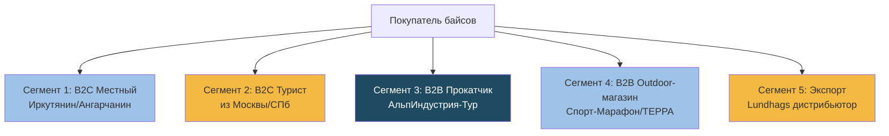
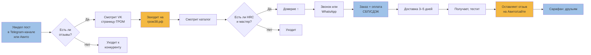
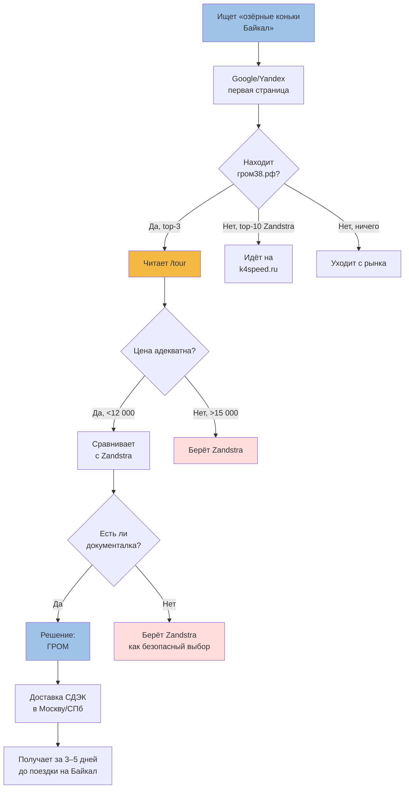
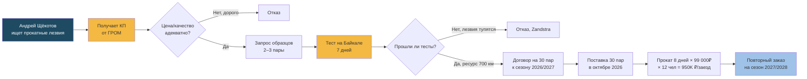
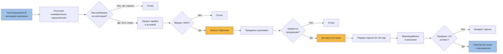
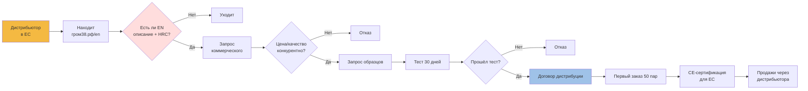
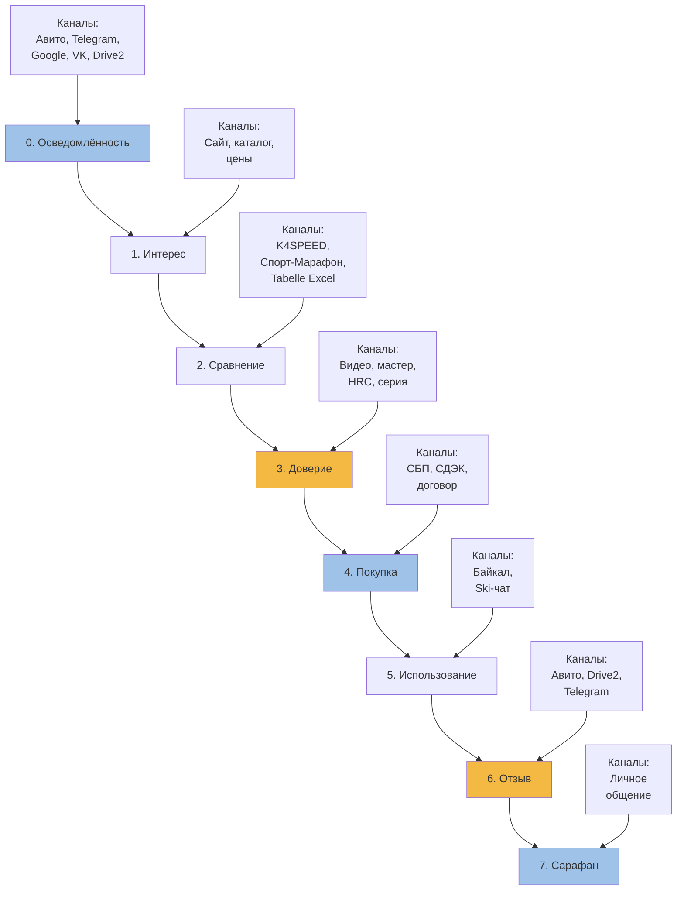
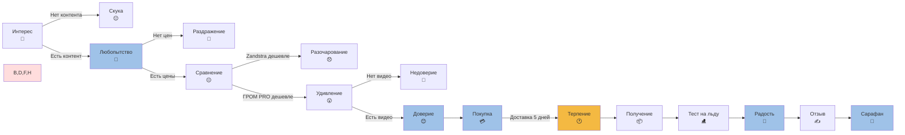

# 🛤️ Customer Journey — путь покупателя ГРОМ

> **Назначение:** карта всех точек контакта покупателя с брендом от первого касания до покупки и после. Основа для контент-плана, CRM и оптимизации конверсии.
> **Метод:** на основе реальных данных (Авито, Drive2, [[Research-Plan]], [[Distribution-Channels]]).
> **Дата:** 02.07.2026.
> **Эпистемология:** этапы основаны на гипотезах 🟡, где не подтверждено интервью.

---

## 1. Сегменты покупателей

ГРОМ имеет **5 чётких сегментов**, каждый с уникальным путём:

| Сегмент | Доля выручки 🟡 | Средний чек | Цикл сделки | Канал |
|---|---|---|---|---|
| B2C Местный | 30% | 8 000 ₽ | 3–7 дней | Авито, VK, Telegram |
| B2C Турист | 20% | 9 000 ₽ | 14–30 дней | Яндекс/Google, Drive2, форумы |
| B2B Прокатчик | 25% | 6 500 ₽ (опт) | 30–60 дней | Личная встреча, договор |
| B2B Outdoor-магазин | 15% | 6 000 ₽ (опт) | 60–90 дней | K4SPEED, Спорт-Марафон |
| Экспорт | 10% | €100 | 90+ дней | Англоязычный сайт, выставки |

---

## 2. Карта пути — Сегмент 1: B2C Местный

### 2.1. Хронология первого касания

### 2.2. Время, контент, точка отказа

| Этап | Канал | Контент | Среднее время | Drop-off 🟡 |
|---|---|---|---|---|
| 1. Осведомлённость | Авито, Telegram, VK, форумы | Объявление, пост, фото | 1 день | 80% |
| 2. Интерес | гром38.рф | Каталог, цены, отзывы | 30 мин | 40% |
| 3. Доверие | Drive2, отзывы Авито | Текст с фото, видео тестов | 20 мин | 30% |
| 4. Заказ | WhatsApp/Т-Банк | Подтверждение, оплата | 10 мин | 10% |
| 5. Доставка | СДЭК | Трек-номер, ожидание | 3–5 дней | 1% |
| 6. Получение | Лично | Осмотр, чек | 5 мин | — |
| 7. Использование | На льду | Первые км | 1–7 дней | — |
| 8. Отзыв | Авито, сайт | Текст + фото/видео | 15 мин | 50% |
| 9. Сарафан | Лично | «Глянь какие байсы» | 1–6 мес | — |

**Конверсия «от осведомлённости до покупки»:** 0.5–2% (типично для outdoor outdoor outdoor outdoor outdoor outdoor outdoor outdoor).

---

## 3. Карта пути — Сегмент 2: B2C Турист

**Главная точка отказа:** **G (цена) и J (документалка)**. Без видео турист берёт Zandstra как «безопасный» выбор.

---

## 4. Карта пути — Сегмент 3: B2B Прокатчик (АльпИндустрия-Тур)

**Критический момент:** F → G. Без реального теста на Байкале договор не подпишут. Нужно **бесплатно отправить 3 пары** на тест до 15.07.2026.

---

## 5. Карта пути — Сегмент 4: B2B Outdoor-магазин

**Тонкость:** категорийный менеджер думает не «какой бренд лучше», а «сколько мы заработаем на полке». Маржа 50% — это минимум.

---

## 6. Карта пути — Сегмент 5: Экспорт

**Главный блокер:** C (нет EN) + N (нет CE). Без этого экспорт невозможен.

---

## 7. Универсальная карта пути (все сегменты)

---

## 8. Точки отказа по сегментам (где теряем)

| Сегмент | Главная точка отказа | Что делать |
|---|---|---|
| B2C Местный | G «Есть ли HRC?» | Добавить HRC + мастера на сайт |
| B2C Турист | G+J «Цена + видео» | Снизить цену Heritage 22→19К или снять видео |
| B2B Прокатчик | F→G «Тест на Байкале» | Бесплатно дать 3 пары на тест |
| B2B Outdoor-магазин | F «Маржа 50%» | Партнёрская программа: первая партия 20 пар со скидкой |
| Экспорт | C «Нет EN» + N «Нет CE» | Сделать /en страницу, начать сертификацию |

---

## 9. Контент-план по этапам пути

| Этап | Цель | Контент | Частота |
|---|---|---|---|
| 0. Осведомлённость | Узнаваемость | Пост в Telegram, Авито, VK, YouTube Shorts | 3–5 постов/нед |
| 1. Интерес | Заход на сайт | SEO-статьи, обзоры, видео | 2 статьи/мес |
| 2. Сравнение | Выбор ГРОМ | Сравнительные таблицы, отзывы, HRC, мастер | 1 таблица + 1 отзыв/нед |
| 3. Доверие | Убедить | Документалка, фото мастера, сертификаты | 1 видео/мес |
| 4. Покупка | Закрыть | CTA, оплата, СДЭК | постоянно |
| 5. Использование | Поддержка | Инструкции, FAQ, поддержка в чате | по запросу |
| 6. Отзыв | Социальное доказательство | Шаблон отзыва, бонус за отзыв | 1 запрос/нед |
| 7. Сарафан | Вирусный рост | Реферальная программа «Приведи друга» | Q4 2026 |

---

## 10. Ключевые метрики (KPI) по этапам

| Этап | Метрика | Текущее 🟡 | Цель Q4 2026 |
|---|---|---|---|
| 0. Осведомлённость | Reach (показы/мес) | 5 000 | 30 000 |
| 1. Интерес | Трафик на сайт (UV/мес) | 800 | 3 000 |
| 2. Сравнение | Глубина просмотра (стр/сеанс) | 2.5 | 4.0 |
| 3. Доверие | Время на странице (сек) | 90 | 180 |
| 4. Покупка | Конверсия в заказ | 1.5% | 3% |
| 5. Использование | Возврат за вторым комплектом | неизв. | 20% |
| 6. Отзыв | Доля покупателей с отзывом | 50% (109/200) | 60% |
| 7. Сарафан | NPS | неизв. | 60+ |
| Repeat purchase | Повторные покупки | неизв. | 15% |

---

## 11. Карта эмоций покупателя (Customer Emotion Map)

**Эмоциональные ямы:** «Скука → Раздражение → Разочарование» — если нет контента, цен, видео. **Эмоциональные пики:** «Доверие → Радость → Сарафан» — если есть документалка и хороший продукт.

---

## 12. Карта касаний по каналам (Touchpoint Matrix)

| Этап | Авито | Сайт | Telegram | Drive2 | VK | YouTube | Лично |
|---|---|---|---|---|---|---|---|
| 0. Осведомлённость | ✅ | ❌ | ✅ | ✅ | ✅ | ✅ | ❌ |
| 1. Интерес | ✅ | ✅ | ✅ | ✅ | ✅ | ✅ | ❌ |
| 2. Сравнение | ✅ | ✅ | ❌ | ✅ | ❌ | ✅ | ❌ |
| 3. Доверие | ✅ | ✅ | ✅ | ✅ | ✅ | ✅ | ❌ |
| 4. Покупка | ✅ | ✅ | ✅ | ❌ | ❌ | ❌ | ✅ |
| 5. Использование | ❌ | ❌ | ✅ | ❌ | ✅ | ❌ | ✅ |
| 6. Отзыв | ✅ | ✅ | ❌ | ✅ | ✅ | ❌ | ❌ |
| 7. Сарафан | ❌ | ❌ | ✅ | ❌ | ✅ | ❌ | ✅ |

**Дыры в матрице:** нет личного контакта на этапах 0–3, нет YouTube на 4–5. Заполнить: видео-консультации, видео-инструкции.

---

## 13. Что сделать на основании этой карты

### Немедленно (P0)
- [x] Добавить HRC + мастера + серию на сайт ([[Site-Redesign-Plan]])
- [ ] Снять документалку производства (5–8 мин)
- [ ] Бесплатно отправить 3 пары на тест в АльпИндустрию-Тур

### Q3 2026
- [ ] Создать /en страницу (этап 0 для экспорта)
- [ ] Сделать видео-обзор каждой SKU (3 мин каждое)
- [ ] Запустить Telegram-канал @grom38 (этапы 0, 1, 5, 7)
- [ ] Реферальная программа «Приведи друга −10%»

### Q4 2026
- [ ] Сравнительная таблица ГРОМ vs Zandstra (этап 2)
- [ ] 10 отзывов на Drive2 (этап 6)
- [ ] Видео-инструкция «Как выбрать размер» (этап 5)

---

## 🔗 Связанные документы

- [[Site-Redesign-Plan]] — что менять на сайте
- [[Distribution-Channels]] — каналы
- [[Premium-Strategy]] — для какого сегмента что делаем
- [[Competitor-Matrix]] — что есть у конкурентов
- [[Research-Plan]] — гипотезы

## 🏷 Теги

`#customer-journey` `#cjm` `#touchpoints` `#conversion` `#funnel` `#b2c` `#b2b` `#export` `#telegram` `#avito` `#drive2` `#grom`

---

_Создано: 02.07.2026. Основа: [[Research-Plan]], [[Distribution-Channels]], [[Site-Redesign-Plan]], Авито, Drive2. Все этапы и метрики — гипотезы 🟡, нужна проверка через Яндекс.Метрику и интервью с 10 клиентами._
