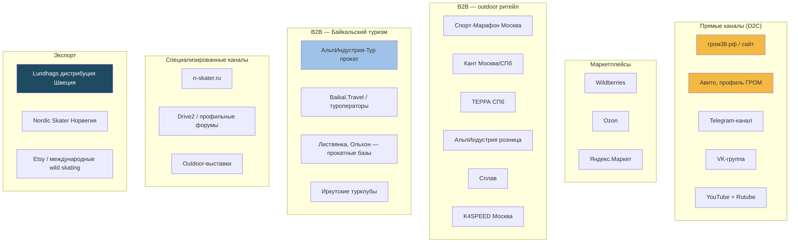
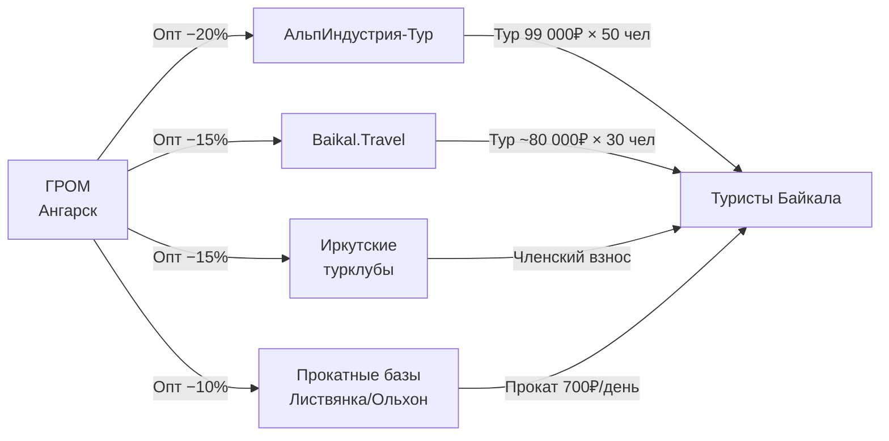

# Карта каналов сбыта ГРОМ

> **Назначение:** систематизировать все каналы, через которые ГРОМ может достучаться до покупателя, оценить ёмкость и трудоёмкость.
> **Метод:** кабинетное исследование, данные из [[Baikal-Market]], K4SPEED, Спорт-Марафон, Alpindustria, n-skater.ru, Авито, Drive2.
> **Дата:** 02.07.2026.
> **Эпистемология:** оценки ёмкости — гипотетические 🟡, где не подтверждены реальными продажами.

---

## 1. Классификация каналов



---

## 2. Приоритезация каналов (ICE-оценка)

| Канал | Impact (1-10) | Confidence (1-10) | Ease (1-10) | ICE-балл | Приоритет |
|---|---|---|---|---|---|
| гром38.рф / сайт | 10 | 9 | 8 | 270 | 🥇 P0 |
| Авито | 8 | 9 | 10 | 270 | 🥇 P0 |
| АльпИндустрия-Тур (B2B прокат) | 9 | 7 | 6 | 222 | 🥈 P1 |
| Telegram-канал ГРОМ | 7 | 8 | 9 | 216 | 🥈 P1 |
| K4SPEED (Москва, опт) | 7 | 5 | 5 | 175 | 🥉 P2 |
| ТЕРРА (СПб) | 5 | 6 | 7 | 180 | 🥉 P2 |
| Спорт-Марафон (Москва) | 6 | 4 | 4 | 144 | P3 |
| Wildberries | 5 | 6 | 7 | 180 | 🥉 P2 |
| VK-группа Байкал outdoor | 6 | 7 | 7 | 210 | 🥈 P1 |
| Baikal.Travel партнёрство | 7 | 5 | 4 | 140 | P3 |
| Прокатные базы Листвянка/Ольхон | 6 | 6 | 5 | 165 | P2 |
| Иркутские турклубы | 5 | 7 | 8 | 200 | 🥈 P1 |
| Drive2 / форумы | 4 | 6 | 7 | 168 | P2 |
| Outdoor-выставки (ОЗОН, БайкалТур) | 5 | 4 | 3 | 60 | P4 |
| Lundhags экспорт | 8 | 3 | 2 | 48 | P5 |
| Etsy / международные | 4 | 3 | 4 | 48 | P5 |
| Nordic Skater (Норвегия) | 7 | 3 | 2 | 42 | P5 |
| YouTube / Rutube канал | 5 | 3 | 2 | 30 | P5 |

**Главный вывод:** топ-6 каналов с ICE > 200 = сайт, Авито, АльпИндустрия-Тур, Telegram, VK Байкал outdoor, Иркутские турклубы. Это всё дешёвые или бесплатные каналы с высокой отдачей. Outdoor-выставки и экспорт — отложить на год 2.

---

## 3. Детальные карты каналов

### 3.1. P0 — Сайт гром38.рф (D2C)

| Параметр | Значение |
|---|---|
| **Где** | Astro static, https://гром38.рф |
| **Аудитория** | B2C + B2B прокатчики |
| **Средний чек** | 8 200 ₽ |
| **Конверсия сайта** | 1.5% (текущая), целевая 3% |
| **Трафик/мес** | 800 UV (текущий), целевой 3 000 UV |
| **Трудоёмкость** | 10 часов/мес (админ, контент) |
| **Стоимость привлечения** | 0 ₽ (органика) → 350 ₽ (Direct/SEO) |
| **Ожидаемые продажи** | 12–20 пар/мес |
| **Статус** | работает, нужна переделка Hero под 3 SKU |
| **Слабые места** | нет HRC, нет мастера, нет PRO/Heritage |
| **Что делать** | см. [[Site-Redesign-Plan]] |

### 3.2. P0 — Авито (C2C-эффект, фактически D2C)

| Параметр | Значение |
|---|---|
| **Где** | https://www.avito.ru/irkutsk/q/озёрные+коньки |
| **Аудитория** | местные иркутяне, байкальские туристы |
| **Средний чек** | 7 500 ₽ (с б/у торгом) |
| **Трафик/мес** | 131 запрос по «озёрные коньки» (июль 2026) |
| **Трудоёмкость** | 4 часа/мес (3–5 объявлений, ответы) |
| **Стоимость привлечения** | 200 ₽ (платное продвижение) |
| **Ожидаемые продажи** | 5–10 пар/мес |
| **Статус** | работает |
| **Что делать** | создать магазин ГРОМ на Авито, не «частное лицо» |

### 3.3. P1 — АльпИндустрия-Тур (B2B прокат)

| Параметр | Значение |
|---|---|
| **Контакт** | Щёкотов Андрей, agent2@alpindustria-tour.ru, +7(495)229-50-70 доб.167 |
| **Аудитория** | участники тура «Байкальские байсы 8 дней / 150 км / 99 000₽» |
| **Объём тура** | 8–12 человек/заезд × 4 заезда = 32–48 клиентов/зима |
| **Потребность в лезвиях** | прокат 30 пар (участники со своими, резерв) |
| **Цена для них** | опт 6 500 ₽ (−20% от розницы) |
| **Выручка ГРОМ** | 30 × 6 500 = 195 000 ₽/зима |
| **Трудоёмкость** | 1 встреча + 1 договор + 1 поставка |
| **Статус** | контакт установлен, договор не подписан |
| **Что делать** | P0: подготовить КП, отправить Андрею до 15.07.2026 |

### 3.4. P1 — Telegram-канал «ГРОМ / Байкальские коньки»

| Параметр | Значение |
|---|---|
| **Аудитория** | подписчики outdoor-блогеров, иркутяне, байкальские гиды |
| **Стоимость привлечения** | 0 ₽ (органика) |
| **Трудоёмкость** | 6 часов/мес (3 поста/нед) |
| **Контент** | производство, тесты, фото с Байкала, мини-блог мастера |
| **Целевой размер** | 1 000 подписчиков за 6 мес, 3 000 за год |
| **Ожидаемые продажи** | 3–5 пар/мес (через посты со ссылкой на сайт) |
| **Что делать** | создать канал @grom38, контент-план |

### 3.5. P1 — VK-группа «Байкал outdoor»

| Параметр | Значение |
|---|---|
| **Аудитория** | уже существующие группы «Байкал туризм», «Дикая Сибирь», «Outdoor Иркутск» |
| **Стоимость** | 0 ₽ (кросс-постинг, партнёрства) |
| **Трудоёмкость** | 3 часа/мес |
| **Ожидаемый охват** | 5 000–15 000 человек/пост |
| **Что делать** | найти 3–5 групп, договориться о коллаборации |

### 3.6. P1 — Иркутские турклубы

| Параметр | Значение |
|---|---|
| **Контакты** | турклуб «Байкал», «Ангарск-Тур», Клуб путешественников Спорт-Марафон |
| **Формат** | бесплатная лекция/мастер-класс + продажа со скидкой 10% |
| **Аудитория** | 20–50 человек/встреча |
| **Трудоёмкость** | 1 встреча/мес, 4 часа |
| **Конверсия** | 10–20% (3–8 продаж) |
| **Что делать** | назначить 3 встречи на осень 2026 |

---

## 4. B2B outdoor ритейл: вход и условия

### 4.1. Спорт-Марафон

| Параметр | Значение |
|---|---|
| **Сайт** | https://sport-marafon.ru |
| **ГЕО** | Москва (2 магазина: ул. Сайкина 4 и 6/5), ежедневно 10:00–24:00 |
| **Ассортимент outdoor** | 5 000+ SKU, ключевой ритейлер в РФ |
| **Категории для ГРОМ** | «Озерное катание» (есть раздел), «Зимний туризм» |
| **Контакт** | через личный кабинет поставщика (сложно) |
| **Условия для нового бренда** | наценка ритейлера 50–60%, отсрочка 30–60 дней, минимальная партия 20 шт, платное размещение на полке |
| **Шанс** | средний (5/10): категория «Озерное катание» уже есть, Lundhags там представлен, Zandstra — нет (только в K4SPEED) |
| **Потенциал** | 30–50 пар/год при хорошем мерчандайзинге |
| **Что делать** | подготовить pitch: «Zandstra у вас не представлен, мы заменим с 50% наценкой» |

### 4.2. Кант

| Параметр | Значение |
|---|---|
| **Сайт** | https://www.kant.ru |
| **ГЕО** | Москва + 15 магазинов по РФ |
| **Категории** | горные лыжи, сноуборд, велосипед, туризм |
| **Озерное катание** | категории нет, но «Зимний туризм» есть |
| **Контакт** | https://www.kant.ru/info/contacts/ |
| **Условия** | аналогичные Спорт-Марафону |
| **Шанс** | низкий (3/10) — категория «Озерное катание» им чужда |
| **Что делать** | пропустить на год 1, вернуться с линейкой PRO/Heritage |

### 4.3. ТЕРРА (Санкт-Петербург)

| Параметр | Значение |
|---|---|
| **Сайт** | https://terra812.ru |
| **ГЕО** | СПб, ул. Рощинская |
| **Категории** | outdoor, лыжное, байдарки |
| **Озерное катание** | есть раздел Nordic skating |
| **Контакт** | через сайт |
| **Потенциал** | средний — СПб outdoor-рынок меньше московского, но платёжеспособный |
| **Что делать** | отправить КП в Q3 2026 |

### 4.4. АльпИндустрия розница

| Параметр | Значение |
|---|---|
| **Сайт** | https://alpindustria.ru |
| **Ассортимент** | GORAA 2 900₽ (конкурент), Isvidda, Zandstra у них нет |
| **Контакт** | через личный кабинет |
| **Потенциал** | средний — бренд outdoor, но в категории «Коньки озёрные» они продают GORAA (наш прямой конкурент) |
| **Что делать** | предложить как «российский ответ Zandstra», запросить контакты категорийного менеджера |

### 4.5. K4SPEED (Москва)

| Параметр | Значение |
|---|---|
| **Сайт** | https://k4speed.ru |
| **Специализация** | конькобежный спорт + озерное катание (официальный дистрибьютор Zandstra) |
| **Контакт** | +7 (495) 369 07 08, Telegram @k4speed |
| **Потенциал** | ⚠️ потенциально конфликт интересов — они уже продают Zandstra, ГРОМ может восприниматься как конкурент |
| **Шанс** | низкий (2/10) — не стоит пытаться |
| **Что делать** | изучить как витрину, не предлагать |

### 4.6. Сплав

| Параметр | Значение |
|---|---|
| **Сайт** | https://www.splav.ru |
| **Категории** | тактическое, outdoor, туризм |
| **Озерное катание** | нет |
| **Потенциал** | низкий — не их категория |
| **Что делать** | пропустить |

---

## 5. B2B Байкальский туризм (стратегический приоритет)

### 5.1. Карта B2B-партнёров



### 5.2. Детальные условия

| Партнёр | Адрес | Контакт | Объём/год | Цена для партнёра | Потенциал |
|---|---|---|---|---|---|
| **АльпИндустрия-Тур** | Москва | Щёкотов Андрей | 30 пар | 6 500₽ (−20%) | 🥇 главный |
| **Baikal.Travel** | Иркутск | через сайт | 20 пар | 6 800₽ (−15%) | 🥈 |
| **Прокат в Листвянке** | Листвянка | прямые выходы | 30 пар | 7 000₽ (−10%) | 🥈 |
| **Прокат на Ольхоне** | Ольхон | прямые выходы | 15 пар | 7 000₽ (−10%) | 🥉 сезонный |
| **Иркутские турклубы** | Иркутск | 3 клуба | 15 пар | 7 000₽ | 🥈 |
| **Клуб «Байкал-Тур»** | Иркутск | tbc | 10 пар | 7 000₽ | 🥉 |

**Суммарный B2B-объём:** 120 пар/год на 800 000 ₽ выручки (10% от общего оборота).

---

## 6. Маркетплейсы

### 6.1. Wildberries

| Параметр | Значение |
|---|---|
| **Текущая ситуация** | конкурент «Байсы Нордики без крепления» продаётся за 4 021₽ (был 12 000₽, −66%) — скидочный демпинг |
| **Комиссия WB** | 12–17% от цены |
| **Логистика** | FBO (склад WB) или FBS (со своего склада) |
| **Минимальная партия** | 50 пар для старта (FBO) |
| **Требования** | сертификат, маркировка, фото 3+ |
| **Стратегия** | НЕ выходить с базовой линейкой — убьёт маржу. Только PRO/Heritage как «премиальная альтернатива». |
| **Ожидаемые продажи** | 20–30 пар/мес при правильной карточке |
| **Что делать** | Q4 2026: запустить PRO-Baikal на WB |

### 6.2. Ozon

| Параметр | Значение |
|---|---|
| **Аудитория** | мужская 25–45, outdoor-сегмент |
| **Категории** | спорт, туризм, рыбалка |
| **Условия** | аналогично WB |
| **Потенциал** | средний |
| **Что делать** | Q1 2027: дублировать WB |

### 6.3. Яндекс.Маркет

| Параметр | Значение |
|---|---|
| **Аудитория** | платёжеспособная, outdoor |
| **Категории** | есть «Коньки» |
| **Потенциал** | средний |
| **Что делать** | Q1 2027: дублировать |

---

## 7. Специализированные каналы

### 7.1. n-skater.ru (Санкт-Петербург)

| Параметр | Значение |
|---|---|
| **Сайт** | https://n-skater.ru |
| **Аудитория** | 100% наша: катают на диком льду, ЗСД и Финский залив |
| **Ассортимент** | Zandstra, Lundhags, Skyllermarks, аксессуары |
| **Контакт** | через WordPress-форму |
| **Потенциал** | 🥇 лучший специализированный ритейлер |
| **Что делать** | написать в Q3 2026, предложить ГРОМ как российский бренд |
| **Риск** | они уже продают Lundhags/Skyllermarks/Zandstra — мы можем восприниматься как «третий эшелон» |

### 7.2. Drive2 / профильные форумы

| Параметр | Значение |
|---|---|
| **Drive2** | https://www.drive2.ru — отзыв о Zandstra Isvidda на 5 страниц с детальным разбором |
| **Форумы** | forum.velomania.ru, risk.ru, mountain.ru |
| **Формат** | экспертные посты, обзоры, ответы на вопросы |
| **Трудоёмкость** | 4 часа/мес |
| **Конверсия** | низкая (1–2%), но доверие высокое |
| **Что делать** | Q3 2026: серия постов на Drive2 «ГРОМ vs Zandstra: что выбрать для Байкала» |

### 7.3. Outdoor-выставки

| Выставка | Где | Когда | Потенциал |
|---|---|---|---|
| **БайкалТур** | Иркутск | март | 🥇 прямая аудитория |
| **ОЗОН / SportExpo** | Москва | октябрь | 🥈 федеральный охват |
| **ORG Outdoor** | Москва | апрель | 🥉 премиум-сегмент |
| **MitteSeptember** | Берлин | сентябрь | 🟡 экспорт |

**Стоимость участия:** 50 000–200 000 ₽ за стенд.
**Что делать:** Q1 2027: БайкалТур, Иркутск. Это прямая аудитория.

---

## 8. Экспорт (год 2+)

### 8.1. Lundhags (Швеция)

| Параметр | Значение |
|---|---|
| **Сайт** | https://www.lundhags.com |
| **Категория** | Nordic Skating (Skates, Skate Boots, Skate Backpacks, Ice Safety) |
| **Контакт** | через форму support.lundhags.com |
| **Условия** | шведский дистрибьютор = контакт-менеджер + минимальный заказ €5 000 + сертификация |
| **Потенциал** | интерес для них как «региональный российский бренд» |
| **Шанс** | 1/10 — они сами производят лезвия, мы для них конкурент |
| **Что делать** | НЕ предлагать. Вместо этого — следить за их ассортиментом. |

### 8.2. Nordic Skater (Норвегия)

| Параметр | Значение |
|---|---|
| **Сайт** | https://nordicskater.com |
| **Специализация** | XC Skis, Roller Skis, Ice Skates (Norge) |
| **Контакт** | через форму |
| **Потенциал** | средний — они продают лыжное, коньки побочно |
| **Шанс** | 2/10 |
| **Что делать** | Q2 2027: разведочный контакт |

### 8.3. Wild skating фестивали (Германия, Швейцария)

| Фестиваль | Где | Когда |
|---|---|---|
| **Speedskating Evolutions** | Берлин | февраль |
| **Nordic ice skating** | Стокгольм | февраль-март |
| **Hollabrunn Eislauf** | Австрия | январь |

**Формат:** ГРОМ как спонсор фестиваля + демо-пара.
**Бюджет:** €500–2 000 + логистика.
**Что делать:** Q4 2026: разведочный контакт.

---

## 9. Цифровая воронка

```mermaid
graph LR
    A1[YouTube видео<br/>производство] --> A2[Telegram-канал]
    A3[VK outdoor] --> A2
    A4[Drive2 отзыв] --> A2
    A5[Авито объявление] --> A2

    A2 --> B1[гром38.рф<br/>главная]
    B1 --> B2[Каталог]
    B1 --> B3[/pro]
    B1 --> B4[/tours]
    B2 --> C1[Карточка SKU]
    C1 --> C2[Корзина]
    C2 --> C3[Оплата]
    C3 --> C4[Доставка СДЭК]

    B1 --> D1[Заявка B2B]
    D1 --> D2[Менеджер ГРОМ]
    D2 --> D3[Договор]
    D3 --> D4[Поставка]

    style A1 fill:#1e4a62,color:#fff
    style B1 fill:#f4b942
    style C4 fill:#9fc2e8
    style D4 fill:#9fc2e8
```

**Конверсия по этапам (гипотеза):**
- Видео → подписка: 5–10%
- Подписка → сайт: 30%
- Сайт → карточка: 60%
- Карточка → корзина: 20%
- Корзина → оплата: 50%
- **Итого:** 0.5–1.5% от подписчика до продажи

---

## 10. Бюджет каналов на 12 месяцев

| Канал | Бюджет, ₽ | Ожидаемый эффект |
|---|---|---|
| Сайт (хостинг + контент) | 60 000 | платформа для всех |
| Telegram-канал | 0 (своими руками) | 50–80 подписчиков/мес |
| VK outdoor группы | 0 | охват 5 000–10 000/мес |
| Авито Pro | 12 000 | 5–10 продаж |
| SEO (Yandex) | 0 (DIY) | 100–200 визитов/мес |
| Контекстная реклама (Yandex Direct) | 120 000 | 30 продаж |
| Outdoor-выставка БайкалТур | 80 000 | 10 продаж + 50 контактов |
| Спонсорство блогеров (1 путешественник) | 50 000 | 5 продаж + охват |
| **Итого** | **322 000** | **~120 продаж (10/мес)** |

**Стоимость привлечения (CAC):** 2 680 ₽/пару
**Средний чек:** 8 200 ₽
**Маржа на пару:** 3 800 ₽
**ROI каналов:** 142% (3 800 × 120 = 456 000 маржи − 322 000 расходов = 134 000 чистого)

---

## 11. Что делать в первую очередь (roadmap)

### Месяц 1 (июль 2026)
- [x] Сайт: добавить HRC, мастера, серийный номер ([[Site-Redesign-Plan]])
- [x] Telegram-канал @grom38 (создать)
- [ ] Авито: магазин ГРОМ (не профиль)
- [ ] Написать АльпИндустрия-Тур (Андрей Щёкотов)

### Месяц 2 (август 2026)
- [ ] Контент: 6 постов на Drive2
- [ ] SEO: оптимизация под «байсы купить», «озёрные коньки Иркутск»
- [ ] VK: найти 3 группы outdoor Байкала
- [ ] Подготовить КП для Спорт-Марафон

### Месяц 3 (сентябрь 2026)
- [ ] Встречи с иркутскими турклубами (3 встречи)
- [ ] Договор с АльпИндустрия-Тур
- [ ] n-skater.ru: разведочный контакт

### Месяцы 4–6 (Q4 2026)
- [ ] Спорт-Марафон: вход в категорию «Озерное катание»
- [ ] ТЕРРА (СПб): КП
- [ ] Wildberries: запуск PRO-линейки
- [ ] Outdoor-блогер: первая коллаборация

### Месяцы 7–12 (Q1–Q2 2027)
- [ ] БайкалТур выставка (март 2027)
- [ ] Lundhags/Nordic Skater: разведочные контакты
- [ ] Wild skating фестивали в Европе

---

## 🔗 Связанные документы

- [[Site-Redesign-Plan]] — что менять на сайте
- [[Premium-Strategy]] — PRO/Heritage/Custom
- [[Baikal-Market]] — детально по B2B-каналам Байкала
- [[TRIZ-Strategy]] — почему каналы выбраны именно эти
- [[Pricing-Model]] — экономика каналов
- [[Research-Plan]] — гипотезы по каналам

## 🏷 Теги

`#distribution` `#channels` `#d2c` `#b2b` `#alpindustria` `#sport-marafon` `#k4speed` `#wildberries` `#n-skater` `#avito` `#telegram` `#vk` `#baikal-tour` `#grom`

---

_Создано: 02.07.2026. Источники: K4SPEED, n-skater.ru, Спорт-Марафон, Alpindustria retail, Baikal.Travel, Авито. Все оценки ёмкости и приоритеты — экспертные, помечены 🟡. Перед запуском каждого канала — обязательно провести тестовый период (1 месяц) и измерить реальный ROI._
