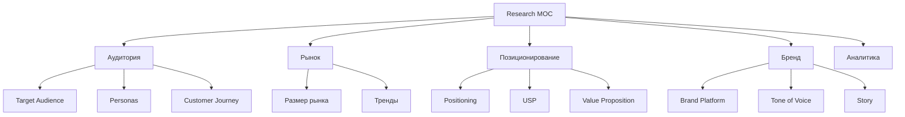

# 🧠 MOC Research

> Исследования, аудитория, позиционирование

---

## 📂 Структура

---

## 📄 Страницы

- [[Target-Audience]] — кто наш клиент
- [[Personas]] — 3-4 персоны
- [[Customer-Journey]] — путь клиента
- [[Market-Size]] — объём рынка
- [[Market-Trends]] — тренды зимнего outdoor
- [[Positioning]] — где мы на карте
- [[Value-Proposition]] — УТП
- [[Brand-Platform]] — бренд-платформа
- [[Tone-of-Voice]] — голос бренда
- [[Analytics-Dashboard]] — дашборд метрик
- [[User-Interviews]] — интервью с клиентами (шаблон)

---

## 🎯 Текущая гипотеза позиционирования

**ГРОМ** — производитель озёрных коньков (байсов) для катания по открытому льду на лыжных ботинках.

**УТП:** собственное производство в Сибири, испытано на Байкале, доступная цена.

**Позиция в нише:** «локальный производитель с экспертизой в зимнем outdoor».

**Целевая аудитория:**
1. Рыбаки-зимники Сибири и Урала
2. Туристы на Байкале
3. Лыжники-любители
4. Outdoor-спортсмены

---

## 🔗 Связанные MOC

- [[../01-Project/MOC-Project|Project]]
- [[../02-Audit/MOC-Audit|Audit]]
- [[../04-Competitors/MOC-Competitors|Конкуренты]]

---

[[../README|⬅ Главная]]