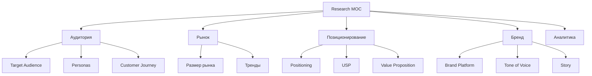

# 🧠 MOC Research

> Исследования, аудитория, позиционирование

---

## 📂 Структура

---

## 📄 Страницы

- [Target-Audience](03-Research/Target-Audience.md) — кто наш клиент
- [Personas](03-Research/Personas.md) — 3-4 персоны
- [Customer-Journey](03-Research/Customer-Journey.md) — путь клиента
- [Market-Size](04-Competitors/Market-Size.md) — объём рынка
- [Market-Trends](04-Competitors/Market-Trends.md) — тренды зимнего outdoor
- [Positioning](03-Research/Positioning.md) — где мы на карте
- [Value-Proposition](03-Research/Value-Proposition.md) — УТП
- [Brand-Platform](03-Research/Brand-Platform.md) — бренд-платформа
- [Tone-of-Voice](03-Research/Tone-of-Voice.md) — голос бренда
- [Analytics-Dashboard](03-Research/Analytics-Dashboard.md) — дашборд метрик
- [User-Interviews](User-Interviews.md) — интервью с клиентами (шаблон)

---

## 🎯 Текущая гипотеза позиционирования

**ГРОМ** — производитель озёрных коньков (байсов) для катания по открытому льду на лыжных ботинках.

**УТП:** собственное производство в Сибири, испытано на Байкале, доступная цена.

**Позиция в нише:** «локальный производитель с экспертизой в зимнем outdoor».

**Целевая аудитория:**
1. Рыбаки-зимники Сибири и Урала
2. Туристы на Байкале
3. Лыжники-любители
4. Outdoor-спортсмены

---

## 🔗 Связанные MOC

- [Project](01-Project/MOC-Project.md)
- [Audit](02-Audit/MOC-Audit.md)
- [Конкуренты](04-Competitors/MOC-Competitors.md)

---

[⬅ Главная](00-Inbox/README.md)