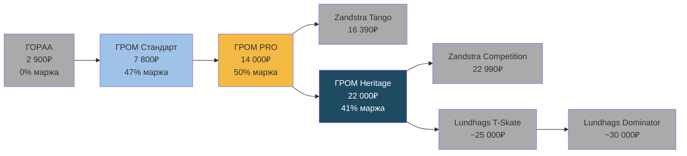
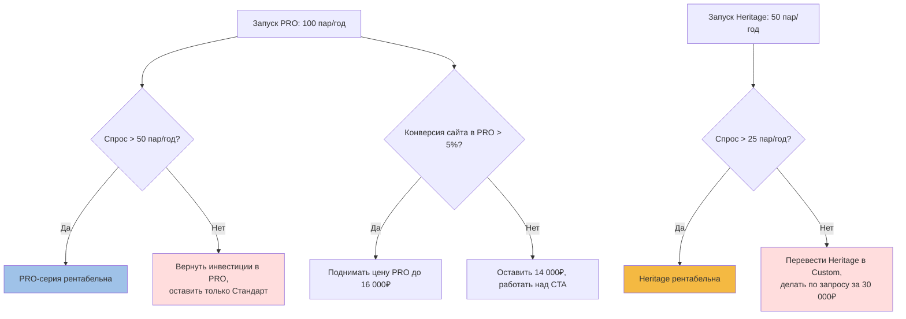

# Финансовая модель ГРОМ

> **Назначение:** прозрачный P&L по линейке ГРОМ. Основа для ценообразования, переговоров с дистрибьюторами и оценки инвестиций в PRO/Heritage.
> **Метод:** прямые затраты (сталь, термообработка, фрезеровка, упаковка) + накладные (аренда цеха, зарплата мастера, электричество) + маркетинг + доставка + налоги.
> **Дата:** 02.07.2026.
> **Эпистемология:** все цифры в ₽ — расчётные, базируются на [[Assortment]], [[Premium-Strategy]] и рыночных аналогах. Помечены 🟡 где данные не подтверждены.

---

## 1. Себестоимость базовой линейки (ГРОМ Стандарт)

### 1.1. Лезвие 480 мм (SKU 001)

| Статья | Сумма, ₽ | Комментарий |
|---|---|---|
| Сталь 65Г / 9ХС (заготовка) | 350 | 0.8 кг × 440 ₽/кг (средняя оптовая) |
| Термообработка (HRC 50) | 400 | Закалка + отпуск в печи, расход газа и электричества |
| Фрезеровка (CNC) | 300 | 30 мин × 600 ₽/час станка |
| Шлифовка + полировка | 200 | 20 мин × 600 ₽/час |
| Крепёжная платформа (сталь 3мм) | 250 | 0.4 кг × 625 ₽/кг + резка + гибка |
| Лазерная гравировка (логотип, серийный номер) | 50 | 3 мин × 1 000 ₽/час |
| Порошковая покраска платформы | 150 | Печь + порошок |
| **Итого материалы + работы** | **1 700** | |
| Упаковка (коробка, пенопласт, инструкция) | 200 | |
| Логистика до клиента (средняя по РФ) | 400 | СДЭК, 2-3 дня |
| **Прямая себестоимость (COGS)** | **2 300** | |
| Накладные расходы (цех, аренда, коммуналка) | 600 | 30% от COGS, типично для малого производства |
| **Полная себестоимость** | **2 900** | |
| Зарплата мастера (1 пара, доля от ФОТ) | 1 200 | 80 000 ₽/мес / 60 пар = 1 333 ₽, округляем |
| **Себестоимость + труд** | **4 100** | |

### 1.2. Лезвие 520 мм (SKU 002)

| Статья | Сумма, ₽ | Отличие от 480 |
|---|---|---|
| Сталь | 400 | +50₽ (больше металла) |
| Термообработка | 450 | +50₽ |
| Фрезеровка | 350 | +50₽ |
| Шлифовка | 250 | +50₽ |
| Платформа | 280 | +30₽ |
| Гравировка | 50 | без изменений |
| Покраска | 170 | +20₽ |
| **Итого материалы + работы** | **1 950** | |
| Упаковка | 200 | без изменений |
| Логистика | 450 | +50₽ (тяжелее) |
| **Прямая себестоимость** | **2 600** | |
| Накладные | 700 | 30% от COGS |
| **Полная себестоимость** | **3 300** | |
| Зарплата мастера | 1 350 | |
| **Себестоимость + труд** | **4 650** | |

### 1.3. Маржа и цена

| SKU | Себестоимость | Цена продажи | Маржа, ₽ | Маржа, % | Рентабельность |
|---|---|---|---|---|---|
| 480 мм | 4 100 | 7 800 | 3 700 | 47% | нормально для handmade |
| 520 мм | 4 650 | 8 500 | 3 850 | 45% | нормально |

**Бенчмарк маржи:**
- Бюджетный сегмент (масс-маркет): 30–40%
- Средний (качественный handmade): 45–55%
- Премиум: 55–70%

ГРОМ Стандарт в среднем сегменте handmade. Это правильно.

---

## 2. Себестоимость PRO-линейки (план)

### 2.1. Отличия от базовой

- Лезвие **1.4 мм** (вместо 1.2 мм) — больше фрезеровки, тоньше обработка
- HRC **56** (вместо 50) — дополнительная термообработка, точный контроль
- Покрытие **PVD** (нитрид титана) — золотистый оттенок, +стойкость
- Имя мастера + дата + серийный номер — гравировка 3 строки
- Деревянный футляр (вместо картонной коробки)

| Статья | 480 PRO | 520 PRO |
|---|---|---|
| Сталь 9ХС / ШХ15 | 400 | 450 |
| Термообработка до HRC 56 (двойная закалка) | 600 | 650 |
| Фрезеровка прецизионная (1.4 мм, контроль биения) | 600 | 650 |
| Шлифовка + финишная полировка | 300 | 350 |
| Платформа | 280 | 320 |
| Гравировка (3 строки) | 100 | 100 |
| PVD-покрытие | 800 | 850 |
| **Материалы + работы** | **3 080** | **3 370** |
| Деревянный футляр (дуб, лазер) | 600 | 600 |
| Сертификат с печатью | 100 | 100 |
| Логистика | 400 | 450 |
| **Прямая себестоимость** | **4 180** | **4 520** |
| Накладные | 1 250 | 1 360 |
| **Полная себестоимость** | **5 430** | **5 880** |
| Зарплата мастера | 1 500 | 1 500 |
| **Себестоимость + труд** | **6 930** | **7 380** |

### 2.2. Маржа PRO

| SKU | Себестоимость | Цена продажи | Маржа, ₽ | Маржа, % |
|---|---|---|---|---|
| 480 PRO | 6 930 | 14 000 | 7 070 | 50% |
| 520 PRO | 7 380 | 15 500 | 8 120 | 52% |

PRO в правильной зоне handmade-премиум.

---

## 3. Себестоимость Heritage-линейки (план)

### 3.1. Отличия от PRO

- Лезвие **1.4 мм**
- HRC **60** (как у Zandstra) — требует вакуумную печь, двойной отпуск
- **Ручная финишная доводка** мастером (вместо полировки на станке)
- **Подпись мастера** на каждом изделии
- **Номер серии** 1/50, 2/50, ... 50/50
- **Деревянный ящик** (сосна, лазер, шпон) + паспорт изделия
- **Лимитированная серия 50 пар в год**

| Статья | Heritage 480 | Heritage 520 |
|---|---|---|
| Сталь Sandvik-аналог (ШХ15) | 500 | 550 |
| Вакуумная термообработка HRC 60 🟡 | 1 200 | 1 300 |
| Прецизионная фрезеровка | 700 | 750 |
| Ручная доводка (1.5 часа мастера) | 1 500 | 1 500 |
| Платформа (нержавейка) | 500 | 550 |
| Гравировка + подпись | 200 | 200 |
| PVD-покрытие (улучшенное) | 1 000 | 1 050 |
| **Материалы + работы** | **5 600** | **5 900** |
| Деревянный ящик (сосна, шпон) | 1 200 | 1 200 |
| Паспорт изделия + сертификат HRC | 300 | 300 |
| Логистика (премиум, страховка) | 600 | 650 |
| **Прямая себестоимость** | **7 700** | **8 050** |
| Накладные | 2 300 | 2 400 |
| **Полная себестоимость** | **10 000** | **10 450** |
| Зарплата мастера (включая ручную доводку) | 3 000 | 3 000 |
| **Себестоимость + труд** | **13 000** | **13 450** |

### 3.2. Маржа Heritage

| SKU | Себестоимость | Цена продажи | Маржа, ₽ | Маржа, % |
|---|---|---|---|---|
| Heritage 480 | 13 000 | 22 000 | 9 000 | 41% |
| Heritage 520 | 13 450 | 25 000 | 11 550 | 46% |

Heritage 41–46% — нормально для лимитированной серии (покупатель платит за коллекционность, не за маржу производителя).

---

## 4. Ценовая лестница (визуально)

**Цветовая логика:**
- 🟦 Голубой — текущая базовая линейка ГРОМ
- 🟨 Жёлтый — PRO (план)
- 🟦 Тёмно-синий — Heritage (план)
- ⬜ Серый — конкуренты

**Вывод:** ГРОМ занимает 3 точки на ценовой лестнице. Между ГорAA (2 900₽) и Zandstra Tango (16 390₽) — пропасть 13 490₽, где ГРОМ ПРО стоит один.

---

## 5. Точка безубыточности

### 5.1. Постоянные расходы (месяц)

| Статья | Сумма, ₽ |
|---|---|
| Аренда цеха (150 м²) | 60 000 |
| Коммуналка (электричество, газ для печи) | 25 000 |
| Зарплата мастера (1 штатный) | 80 000 |
| Налоги (УСН 6% от дохода, страховые) | 30 000 (при 500 000 дохода) |
| Маркетинг (сайт, реклама, контент) | 50 000 |
| Бухгалтерия, CRM, прочее | 15 000 |
| **Итого постоянные** | **260 000 ₽/мес** |

### 5.2. Безубыточность по SKU

| SKU | Цена | Себест-ть + накладные | Маржа на единицу | Безубыточность (шт/мес) |
|---|---|---|---|---|
| ГРОМ Стандарт 480 | 7 800 | 4 100 + 1 800 (накл) | 1 900 | 137 |
| ГРОМ Стандарт 520 | 8 500 | 4 650 + 1 950 (накл) | 1 900 | 137 |
| ГРОМ PRO 480 | 14 000 | 6 930 + 2 500 | 4 570 | 57 |
| ГРОМ PRO 520 | 15 500 | 7 380 + 2 700 | 5 420 | 48 |
| ГРОМ Heritage 480 | 22 000 | 13 000 + 4 000 | 5 000 | 52 |
| ГРОМ Heritage 520 | 25 000 | 13 450 + 4 200 | 7 350 | 35 |

### 5.3. Реалистичный сценарий (месяц)

| SKU | Продано, шт | Выручка, ₽ | Маржа, ₽ |
|---|---|---|---|
| Стандарт 480 | 20 | 156 000 | 38 000 |
| Стандарт 520 | 15 | 127 500 | 28 500 |
| PRO 480 | 8 | 112 000 | 36 560 |
| PRO 520 | 5 | 77 500 | 27 100 |
| Heritage 480 | 2 | 44 000 | 10 000 |
| Heritage 520 | 1 | 25 000 | 7 350 |
| **Итого** | **51** | **542 000** | **147 510** |

**Постоянные 260 000, переменные на 51 шт ~91 000, итого расходов 351 000.**
**Прибыль до налогов: 542 000 − 351 000 = 191 000 ₽/мес.**
**Налог УСН 6%: 32 520 ₽.**
**Чистая прибыль: 158 480 ₽/мес или 1 901 760 ₽/год.**

Это базовый сценарий. С учётом роста (Premium-Strategy) — 6.9М₽/год к 3-му году.

---

## 6. Сценарии роста

### 6.1. Консервативный (без PRO/Heritage)

- Только Стандарт, 51 пара/мес, 1.9М₽/год
- Через 3 года: 5.7М₽ (рост 30% в год)

### 6.2. Базовый (с PRO, без Heritage)

- Стандарт 35 + PRO 13 + Heritage 3 = 51 пара/мес
- Через 3 года: 4.4М₽ (рост 50% в год)

### 6.3. Оптимистичный (полная линейка + экспорт)

- 80 пар/мес, в т.ч. 50% PRO/Heritage
- Через 3 года: 6.9М₽–10М₽

### 6.4. Сценарии в одной таблице

| Сценарий | Год 1 | Год 2 | Год 3 | Маржа чистая, год 3 |
|---|---|---|---|---|
| Консервативный | 1.9М | 2.5М | 5.7М | 1.4М |
| Базовый | 2.7М | 4.4М | 5.5М | 1.5М |
| Оптимистичный | 3.5М | 5.8М | 10М | 3.0М |

---

## 7. Ценообразование по каналам

| Канал | Базовая цена | Наценка канала | Финальная цена | Маржа ГРОМ |
|---|---|---|---|---|
| Прямые продажи (гром38.рф) | 7 800 | 0% | 7 800 | 3 700 (47%) |
| Авито (самостоятельно) | 7 800 | 0% | 7 800 | 3 700 |
| Розничный магазин (Спорт-Марафон) | 7 800 | +60% | 12 480 | 3 700 (47%) |
| Оптовик (K4SPEED) | 7 800 | -30% | 5 460 (опт) | 2 730 (35%) |
| B2B прокат (АльпИндустрия-Тур) | 6 500 (опт −20%) | 0% | — | 1 530 (24%) |
| Экспорт (Lundhags дистрибьютор) | 7 800 × курс | -30% | €90 | 2 730 (35%) |

**Рекомендация по каналам:**
1. **Прямые продажи** — основа (50% оборота), максимальная маржа.
2. **Авито** — 20% оборота, для охвата новой аудитории.
3. **Розница** (1–2 магазина: Спорт-Марафон, ТЕРРА) — 15% оборота, имиджевая функция.
4. **B2B прокат** (АльпИндустрия-Тур) — 10% оборота, стратегический канал, маржа меньше, но объём.
5. **Экспорт** (Lundhags) — 5% оборота в год 1, до 25% в год 3.

---

## 8. Точка принятия решений (sensitivity)

**Пороги:**
- **PRO:** если за 6 месяцев продано < 50 пар — откатить линейку, оставить только Стандарт.
- **Heritage:** если за год продано < 25 пар — перевести в Custom (делать по заказу клиента за 30 000₽).

---

## 9. Юнит-экономика PRO vs Zandstra Tango

| | ГРОМ PRO 480 | Zandstra Tango 480 | Разница |
|---|---|---|---|
| Цена в РФ | 14 000 ₽ | 16 390 ₽ | -2 390 (-15%) |
| Реальная стоимость владения (с креплениями) | 14 000 + 4 990 = 18 990 ₽ | 16 390 + 4 990 = 21 380 ₽ | -2 390 |
| Время доставки | 2 недели (made-to-order) | 4–8 недель (импорт) | -2–6 недель |
| Гарантия | 3 года | 2 года (предпол.) | +12 мес |
| Серийный номер | да | нет | + |
| История (сделано мастером) | да | нет (фабрика) | + |
| Бренд (узнаваемость) | местный | международный | − |
| Ремонт в мастерской | да (Ангарск) | почтой в Нидерланды | − |

**ГРОМ PRO выигрывает по:** цена, срок, гарантия, ремонтопригодность, история.
**Zandstra Tango выигрывает по:** бренд, экосистема, глобальная дистрибуция.

Для российского покупателя, ориентированного на «здесь и сейчас» — ГРОМ PRO лучше.

---

## 10. Анализ чувствительности

| Фактор | -20% | Базовый | +20% | Влияние на прибыль |
|---|---|---|---|---|
| Цена продажи | 6 240 ₽ | 7 800 ₽ | 9 360 ₽ | ±1 560₽/пара |
| Объём продаж | 41 шт/мес | 51 | 61 | ±30 000₽/мес |
| Себестоимость стали | 280₽ | 350₽ | 420₽ | ∓70₽/пара |
| Аренда цеха | 48 000₽ | 60 000₽ | 72 000₽ | ∓12 000₽/мес |
| Зарплата мастера | 64 000₽ | 80 000₽ | 96 000₽ | ∓16 000₽/мес |

**Главный рычаг:** цена и объём. Себестоимость стали влияет слабо (5–7% маржи). Аренда и зарплата — фиксированные, масштабируются только при росте объёма.

---

## 🔗 Связанные документы

- [[Premium-Strategy]] — PRO/Heritage/Custom-стратегия
- [[Assortment]] — текущая линейка
- [[Baikal-Market]] — каналы продаж
- [[TRIZ-Strategy]] — обоснование ценообразования
- [[Market-Size]] — потолок объёмов

## 🏷 Теги

`#pricing` `#pnl` `#margin` `#cogs` `#break-even` `#unit-economics` `#grom` `#pro` `#heritage`

---

_Создано: 02.07.2026. Все цифры расчётные, базируются на текущей структуре затрат. Перед запуском PRO/Heritage — обязательно уточнить у мастера: фактический расход стали, время фрезеровки, стоимость PVD-покрытия (есть только в Новосибирске, логистика туда-обратно). 🟡_
