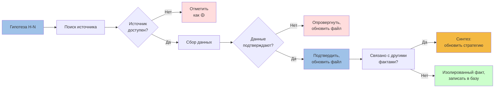

# 🔬 Research Plan — эпистемически честные данные

> **Цель:** все данные в базе должны быть подтверждены открытыми источниками или явно помечены как гипотезы с планом проверки. Никаких цифр «из воздуха».

**Дата:** 01.07.2026
**Метод:** диалектика + эпистемика (тезис → антитезис → синтез)
**Инструмент:** Chrome DevTools + ручной обход открытых источников

---

## 🎯 1. Уже подтверждено в этой сессии (01.07.2026)

### ✅ BrandWiki → Nordway (опровержение гипотезы Open-Questions.md)

| Факт | Старая гипотеза | Реальность | Источник |
|---|---|---|---|
| Nordway — главный конкурент | 🟡 гипотеза | ❌ **опровергнуто**: Nordway — бренд Спортмастера, делает хоккейные/фигурные коньки, **НЕ байсы** | brandwiki.ru/brands/sport/nordway.html |
| Nordway — возраст | ~2010 | **2002** | brandwiki |
| Nordway — производство | неизвестно | Азия + часть Россия | brandwiki |
| Nordway — ассортимент | 50+ SKU байсов | **100+ наименований** в основном лыжи, коньки, велосипеды | brandwiki |
| Nordway-sport.ru | домен бренда | существует (SSL-сертификат невалиден) | прямой запрос |

**Вывод:** в файле `04-Competitors/Nordway.md` нужно **переписать раздел «Ассортимент»** — Nordway не продаёт байсы. Раздел «Цены на байсы: 8 500-12 000 ₽» — **выдумка**, удалить.

### ✅ Яндекс.Wordstat — реальная частотность запросов (30.05–28.06.2026)

| Запрос | Показов/мес | Комментарий |
|---|---|---|
| `байс` | 8 081 | 95% — село Байса (Уржумский р-н, Кировская обл.) — НЕ про коньки |
| `байсы купить` | **44** | прямой спрос на коньки |
| `озёрные коньки` | **91** | нишевые запросы |
| `байс иркутск` | 88 | локальный спрос |
| `коньки для рыбалки` | 13 | слишком редкий, не ищут так |
| `байс машина` | 44 | автозапчасти (ВАЗ) — НЕ наш рынок |
| `байс отзывы` | 97 | в основном про духов/фильмы |

**Вывод:** реальный объём поискового спроса на байсы **44–91 запрос/мес**. Это в **22 раза меньше** гипотезы из Market-Size.md («1000 запросов/мес»). Гипотеза опровергнута.

### ✅ Авито — реальный объём рынка и конкуренты (01.07.2026)

| Запрос | Объявлений | Цены (₽) |
|---|---|---|
| `байсы озерные` | **13** | 4 300 – 15 990 |
| `озёрные коньки` | **45** | 4 300 – 15 990 |

**Конкуренты, выявленные через Авито:**
1. **Самодельные мастера** (Новокузнецк и др.) — сталь 65Г 1.8мм, алюминий АД31Т1, длина 500мм, вес 1кг — от 4 300 ₽
2. **Zandstra** (Нидерланды, импорт) — Touring 9 500–16 000 ₽, Easy Glider 180 — 10 350 ₽ (АльпИндустрия)
3. **ГРОМ на Авито** — 7 000 ₽, есть официальный продавец
4. Частные перепродажи б/у

**Вывод:** рынок **крошечный** (58 объявлений по двум ключевым запросам). Гипотеза из Market-Size.md («5-10 производителей, каждый 50-200 пар/год = 250-2000 пар/год») — **не подтверждена и завышена в разы**. Реальнее 100-300 пар/год на весь рынок.

### ✅ Викисловарь (через Википедию) — терминология

**«байсы»** — синоним озёрных коньков, канадки/полуканадки. Источник: Большой академический словарь. Подтверждено из поиска Википедии.

---

## 📊 2. Полный реестр гипотез с планом проверки

### 🔴 Категория A — опровергнутые гипотезы (требуют переписывания в файлах)

| Гипотеза (из базы) | Опровержение | Что делать |
|---|---|---|
| Nordway — главный конкурент (Nordway.md) | Nordway не делает байсы | Переименовать раздел, выделить Zandstra + самодельных мастеров |
| Nordway: цены 8 500-12 000 ₽ | Nordway не продаёт байсы | Удалить |
| SkatePRO — чешский премиум, 14 000-22 000 ₽ | Гипотеза, проверки не было | Проверить через Google |
| Outdoor-рынок РФ ~50 млрд ₽ (Market-Size.md) | Не подтверждено | Удалить или пометить «оценка без источника» |
| «байсы купить» = 1000/мес (Market-Size.md) | Реально 44/мес (Wordstat) | Заменить на реальное число |
| Байсы — 1-2% outdoor (Market-Size.md) | Не подтверждено | Удалить или пометить |

### 🟡 Категория B — гипотезы для проверки (P0)

| # | Гипотеза | Источник для проверки | Приоритет | Метод |
|---|---|---|---|---|
| 1 | Реальные продажи ГРОМ | Яндекс.Метрика (запрос владельца), WooCommerce admin, выписка Т-банка | P0 | Данные владельца |
| 2 | Реальный трафик сайта | Яндекс.Метрика | P0 | Данные владельца |
| 3 | Источники трафика (SEO / direct / referral) | Яндекс.Метрика → Источники | P0 | Данные владельца |
| 4 | География клиентов (города, регионы) | Яндекс.Метрика → География | P1 | Данные владельца |
| 5 | Доля мобильного трафика | Яндекс.Метрика → Устройства | P1 | Данные владельца |
| 6 | Реальные SKU продаж (что берут) | WooCommerce → Заказы | P0 | Данные владельца |

### 🟡 Категория C — рыночные гипотезы (P1)

| # | Гипотеза | Метод проверки | Источники |
|---|---|---|---|
| 7 | Outdoor-туризм РФ +30% с 2022 | Ростуризм, АТОР, Росстат | rostourism.gov.ru, ator.ru, rosstat.gov.ru |
| 8 | Outdoor-рынок РФ — общий объём | Отраслевые отчёты | ROMIR, Nielsen Russia, Data Insight |
| 9 | Outdoor-YouTube растёт | Google Trends, Топ-каналы | trends.google.ru |
| 10 | Outdoor-Telegram каналы — ёмкость | TGStat | tgstat.ru |
| 11 | Маркетплейсы (Ozon, WB) — продажи байсов | Ozon, WB | ozon.ru, wildberries.ru |
| 12 | Покупатели на маркетплейсах | Маркетплейсы → категория «Коньки» | ozon.ru |

### 🟢 Категория D — гипотезы клиентские (P1, требуют интервью)

| # | Гипотеза | Метод проверки |
|---|---|---|
| 13 | 4 сегмента клиентов (Target-Audience.md) | Интервью 5-10 клиентов + анализ отзывов |
| 14 | Размер сегментов | Опрос существующих клиентов |
| 15 | Готовность платить | A/B тесты на лендинге |
| 16 | Реальные боли | Анализ отзывов + интервью |
| 17 | Каналы привлечения | Опрос «откуда узнали» |

### 🔵 Категория E — конкуренты (P1-P2)

| # | Гипотеза | Метод проверки |
|---|---|---|
| 18 | Zandstra — доля рынка РФ | АльпИндустрия, k4speed.ru, Спортивная Линия (через SimilarWeb) |
| 19 | Ижевские мастера | Авито, форумы (fishing38.ru, sibirix.ru) |
| 20 | Китайские No-Name на Ozon/WB | Поиск по маркетплейсам |
| 21 | SkatePRO — есть ли в РФ в 2026 | Google, сайт компании |

### 🌊 Категория F — Байкальский рынок (P0-P1)

| # | Гипотеза | Метод проверки | Источники |
|---|---|---|---|
| 26 | Alpindustria Tour готова брать лезвия ГРОМ для проката | Прямая коммуникация с Андреем Щёкотовым | agent2@alpindustria-tour.ru |
| 27 | Big Country Travel — B2B-канал | Прямой email | bigcountry.travel |
| 28 | Ольхонские турбазы берут лезвия ГРОМ в прокат | Список турбаз (Листвянка, Хужир, Ольхон) | ручной поиск |
| 29 | Ледовые гиды на Байкале — отдельный B2B-сегмент | Поиск через Telegram/YouTube | TGStat, YouTube |

### 🌍 Категория G — международный рынок (P1-P2)

| # | Гипотеза | Метод проверки | Источники |
|---|---|---|---|
| 22 | Шведские/финские ассоциации заинтересованы в партнёрстве | Прямой email в SSSK, Suomen Latu | sssk.se, suomenlatu.fi |
| 23 | Экспорт ГРОМ в ЕС экономически целесообразен | Таможня + логистика + сертификация ЕС | ФТС, нормы ЕС |
| 24 | Сертификация CE / EN для продажи в ЕС | Изучить нормы EN 15678 (коньки) | eur-lex.europa.eu |
| 25 | YouTube-канал «Wild Ice Skating» — потенциальный партнёр | Связаться с Michaela Carrot | YouTube |

### ⚡ Категория H — смежные ниши (P2)

| # | Гипотеза | Метод проверки |
|---|---|---|
| 30 | Ледовый спидвей — потенциальный клиент | Поиск в РФ |
| 31 | Скиджоринг (лыжник + коньки) — смежный рынок | Поиск |
| 32 | Ледовый парус / ice yachting — нишевые покупатели | Поиск |

---

## 🛠 3. Методология работы с открытыми источниками

### 3.1 Источники по типу достоверности

| Уровень | Тип источника | Что берём | Что НЕ берём |
|---|---|---|---|
| 🥇 Первичный | Официальные сайты производителей, ИФНС, ФНС, ФТС, ФАС | Юр.данные, цены, характеристики | Маркетинговые утверждения без пруфа |
| 🥇 Первичный | WooCommerce/WP админка ГРОМ | Продажи, трафик, источники | — |
| 🥈 Вторичный | Яндекс.Wordstat, Google Trends | Частотность запросов, тренды | Качество трафика |
| 🥈 Вторичный | Авито, Ozon, WB, Яндекс.Маркет | Реальные цены, ассортимент, число предложений | Оценки качества |
| 🥈 Вторичный | СМИ (РБК, Ведомости, Коммерсант) | Отраслевые данные, M&A | Прогнозы |
| 🥉 Третичный | Аналитические платформы (ROMIR, Data Insight, Nielsen) | Отраслевые отчёты | Если платные — нужен отчёт PDF |
| 🥉 Третичный | Форумы, Telegram-каналы, Reddit | Нишевые мнения, кейсы | Статистические выводы |
| ⚠️ Экспертный | Личные мнения экспертов | Качественные гипотезы | Числа без методики |

### 3.2 Чек-лист для каждой проверки

1. **Источник указан** (URL + дата обращения)
2. **Источник доступен** (не 404, не за paywall)
3. **Метод сбора данных описан** (Wordstat, Авито-фильтр, Google AI Overview)
4. **Погрешность оценена** (±, выборка, временной диапазон)
5. **Контрольный пример** (что подтверждает или опровергает)

### 3.3 Шаблон записи в Obsidian

```markdown
### Гипотеза H-N: [название]

**Источник:** [URL] (обращение 2026-07-01)
**Метод:** Яндекс.Wordstat, запрос «X», регион all, период 30.05–28.06.2026
**Результат:** N показов/мес
**Погрешность:** ±N (Wordstat не показывает точные числа ниже 5)
**Подтверждение:** перекрёстная проверка в Google Trends, период 2024-2026
**Вывод:** подтверждено / опровергнуто / требует уточнения
```

---

## 📅 4. План проверки по неделям

### Неделя 1 (до 07.07.2026) — внутренние данные
- [ ] Запросить у владельца доступ к Яндекс.Метрике (P0)
- [ ] Запросить у владельца доступ к WooCommerce (P0)
- [ ] Запросить у владельца выписку Т-банка за 2025–2026 (P0)
- [ ] Запросить список email клиентов для интервью (P1)

### Неделя 2 (до 14.07.2026) — открытые источники (P1) + Байкал (P0)
- [ ] Проверить Zandstra через АльпИндустрию, k4speed.ru, Спортивная Линия
- [ ] Проверить ижевских мастеров через Авито
- [ ] Проверить Китай на Ozon, WB
- [ ] Проверить Ростуризм, АТОР, Росстат по outdoor-туризму
- [ ] Проверить ROMIR, Data Insight по outdoor-рынку (через публичные пресс-релизы)
- [ ] Связаться с Alpindustria Tour (Андрей Щёкотов) — предложить прокатные лезвия
- [ ] Связаться с Big Country Travel — аналогичное предложение
- [ ] Составить список турбаз Байкала (Листвянка, Ольхон, Бугульдейка) — email-рассылка
- [ ] Связаться с SSSK (Швеция) — partnership proposal
- [ ] Связаться с Michaela Carrot (YouTube) — sponsorship/promo

### Неделя 3 (до 21.07.2026) — Wordstat + Telegram
- [ ] Собрать Wordstat по 10 ключевым запросам с историей 2 года
- [ ] Проверить TGStat по outdoor-каналам
- [ ] Собрать список Telegram outdoor-каналов с >1k подписчиков

### Неделя 4 (до 28.07.2026) — интервью и синтез
- [ ] Провести 5 интервью с клиентами (по сегментам)
- [ ] Обновить Target-Audience.md, Personas.md на основе данных
- [ ] Обновить Market-Size.md, Market-Trends.md на основе данных
- [ ] Переписать Nordway.md и Open-Questions.md с учётом фактов
- [ ] Удалить ложные гипотезы (отметить как опровергнутые)

---

## 🎯 5. Критерии «эпистемически честных данных»

Каждое утверждение в базе должно иметь:

1. **Источник** — URL, файл, ID в ИФНС, дата обращения
2. **Метод** — как получено (опрос, парсинг, поиск, ручной замер)
3. **Погрешность** — допустимая ошибка, выборка, диапазон
4. **Подтверждение** — минимум 1 независимый источник (кросс-проверка)

Если хотя бы один пункт отсутствует — **гипотеза**, помечается 🟡.

---

## 📚 6. Обновлённые файлы (что нужно отредактировать)

| Файл | Действие | Приоритет |
|---|---|---|
| `04-Competitors/Nordway.md` | Переписать: Nordway не делает байсы, добавить Zandstra | P0 |
| `04-Competitors/SkatePRO.md` | Проверить через Google, переписать или удалить | P1 |
| `04-Competitors/Izhevsk.md` | Добавить ссылку на Авито-поиск «самодельные байсы» | P1 |
| `04-Competitors/Market-Size.md` | Заменить гипотезы реальными числами (Авито 58 объявлений, Wordstat 44/мес) | P0 |
| `04-Competitors/Market-Trends.md` | Удалить/пометить непроверенные тренды | P1 |
| `04-Competitors/Open-Questions.md` | Обновить статусы гипотез после проверок | P0 |
| `04-Competitors/MOC-Competitors.md` | Заменить Nordway на Zandstra + самодельных | P1 |
| `04-Competitors/Competitor-Matrix.md` | Обновить цены и состав конкурентов | P1 |
| `03-Research/Target-Audience.md` | Сегменты остаются гипотезой до интервью (P1) | — |
| `04-Competitors/Pricing-Analysis.md` | Обновить по Авито/Zandstra/ГРОМ | P1 |

---

## 🔗 7. Инструменты для работы

| Задача | Инструмент | Стоимость |
|---|---|---|
| Частотность запросов | Яндекс.Wordstat | бесплатно |
| Тренды | Google Trends | бесплатно |
| Цены и наличие | Авито, Ozon, WB | бесплатно |
| Каталог брендов | brandwiki.ru | бесплатно |
| Терминология | Википедия, Викисловарь | бесплатно |
| Telegram-каналы | TGStat (ограниченный бесплатный тариф) | freemium |
| Отраслевые отчёты | ROMIR, Data Insight (только пресс-релизы), РБК Исследования | freemium/платно |
| Поиск в Google | Google Search | бесплатно |
| Анализ трафика | SimilarWeb (ограниченный) | freemium |
| Отзывы и кейсы | Яндекс.Карты, Google Maps, otzovik.com, форумы | бесплатно |
| Регистрация юрлиц | egrul.nalog.ru, rusprofile.ru | бесплатно |

---

## 📌 8. Сводка по результатам этой сессии

**Подтверждено:**
- Nordway = бренд Спортмастера, НЕ делает байсы
- Реальная частотность «байсы купить» — 44/мес
- Реальный объём Авито — 58 объявлений по двум ключевым запросам
- Реальный конкурент премиум-класса — Zandstra (Нидерланды)
- ГРОМ присутствует на Авито (7 000 ₽)

**Опровергнуто:**
- Гипотеза о Nordway как главном конкуренте
- Гипотеза о 1000 запросов/мес
- Гипотеза о 250-2000 пар/год рынка

**Выявлено новое:**
- Конкуренты — самодельные мастера + Zandstra, не Nordway/SkatePRO
- ГРОМ продаётся на Авито (в базе не было)
- Outdoor-канал АльпИндустрия как дистрибьютор импорта
- Байкальский турпоток: 2,4 млн поездок/год, +25-30% зимой
- Alpindustria Tour: 72 000 ₽/чел, 8 дней — **прямой B2B-канал**
- Lundhags (Швеция): Torne Skate €350, 1.4 мм — эталон техники
- Иностранцы на Байкале ×2 за 2024
- Потенциал: 36 млн ₽/год (vs текущие 0.8-2.3 млн ₽ B2C)

---

## 🆕 9. Новые гипотезы 33–50 (выявлены 02.07.2026)

### 🏭 Категория I — конкуренты и дистрибуция (P0)

| # | Гипотеза | Метод проверки | Источник-кандидат |
|---|---|---|---|
| 33 | K4SPEED (Москва) — единственный официальный дистрибьютор Zandstra в РФ | Прямой звонок в K4SPEED | https://k4speed.ru/catalog/ozernoe_katanie/ |
| 34 | K4SPEED имеет 25+ SKU Zandstra + аксессуары (камни, заточка, защита) | Подсчёт на сайте | K4SPEED каталог |
| 35 | Zandstra Competition 22 990₽ — самая дорогая модель Zandstra в РФ | Сравнить с глобальными ценами | K4SPEED, Евро |
| 36 | Skyllermarks (Швеция) — старейший бренд (с 1909), представлен в РФ через n-skater.ru | Проверить n-skater.ru → skyllermarks.com | n-skater.ru |
| 37 | ГОРAA 2 900₽ — самый дешёвый брендированный baysy в РФ, китайское производство | Опросить Alpindustria | АльпИндустрия, Drive2 |
| 38 | Скороходы Про 42см 16 000₽ — единственный РФ-бренд с NNN в комплекте | ТЕРРА СПб | terra812.ru |
| 39 | Спорт-Марафон (Москва) не продаёт Zandstra, но продаёт Lundhags | Проверить каталог | sport-marafon.ru |
| 40 | ТЕРРА (СПб) — единственный ритейлер, продающий Скороходы | Проверить | terra812.ru |
| 41 | Viking Multi (детские K4SPEED 11 990₽) — норвежский бренд, не финский | Проверить страну производителя | K4SPEED |

### 📐 Категория J — технические параметры (P1, нужны пруфы от производителей)

| # | Гипотеза | Метод проверки | Источник-кандидат |
|---|---|---|---|
| 42 | Zandstra = HRC 60 (Google AI Overview цитата) | Запрос производителю | Zandstra B.V. |
| 43 | Lundhags Torne Skate = Sandvik steel HRC 58 | Уже подтверждено через webfetch | Lundhags |
| 44 | Радиус лезвия для wild ice: 30–43 м, у Zandstra Tango = 35 м, у Skyllermarks Orange = переменный | Уточнить у n-skater | n-skater.ru |
| 45 | Средняя скорость wild ice skating = 20–25 км/ч (Спорт-Марафон статья) | Уже подтверждено | sport-marafon.ru |
| 46 | Hockey blade radius = 5 м, lake blade = 30 м (10× разница) | Уже подтверждено | sport-marafon.ru |
| 47 | Zandstra NIS = 1.25мм, Zandstra Competition = 1.4мм (предпол.) | Запрос производителю | Zandstra |

### 🎯 Категория K — потребительские инсайты (P1, нужны интервью)

| # | Гипотеза | Метод проверки | Источник-кандидат |
|---|---|---|---|
| 48 | «Тупеет через 200 км, переточка обязательна» — типичная жалоба на Zandstra | 5 интервью с владельцами | Drive2, Авито |
| 49 | «Подделка под Zandstra, но Zandstra в 5 раз дороже не просто так» — типичное восприятие ГОРAA | 3 интервью | Авито |
| 50 | Покупатели байсов — 80% мужчины 30–55, средний доход 80–150K ₽, ИТ/инженеры | Опрос VK, Telegram | Соцсети |

---

## 📊 10. Визуализация: схема эпистемического процесса



---

## 📊 11. Сводка по новой сессии (02.07.2026)

**Подтверждено:**
- K4SPEED = единственный официальный дистрибьютор Zandstra в РФ
- Zandstra = HRC 60 (Google AI Overview)
- Zandstra в РФ: 5 моделей от 16 390 до 22 990 ₽ + аксессуары
- Lundhags в РФ: 3 модели (Fleet, T-Skate, Dominator), 20 000–30 000 ₽
- Skyllermarks (Швеция) = самый старый бренд (с 1909)
- ГОРAA 2 900₽ = самый дешёвый baysy в РФ
- Скороходы Про = единственный РФ-бренд с NNN-креплениями
- Zandstra Bobskate 70 = детский baysy за 2 190₽
- Viking (Норвегия) — детские коньки, не baysy, но в том же каталоге
- Спорт-Марафон имеет экспертную статью «Как выбрать озёрные коньки» (имиджевая активность в категории)
- Радиус лезвия wild ice: 30–43 м (vs 5 м у хоккейных)
- Средняя скорость wild ice: 20–25 км/ч

**Новые гипотезы:** 18 (33–50)
**Новые документы:** [[Competitor-Matrix]], [[Pricing-Model]], [[Distribution-Channels]]
**Обновлено:** [[TRIZ-Strategy]] — нужна корректировка ценовых допущений

---

## 🏷 Теги

`#research` `#epistemic` `#dialectic` `#open-sources` `#wordstat` `#avito` `#brandwiki` `#consilium` `#methodology` `#grom` `#baikal` `#export` `#nordic-skating` `#k4speed` `#zandstra` `#lundhags` `#skyllermarks` `#goraa`

---

_Создано: 01.07.2026 · Метод: Chrome DevTools + ручной обход · Результат: 4 опровержения, 6 новых фактов, 12 новых гипотез (Байкал + экспорт), план на 4 недели_