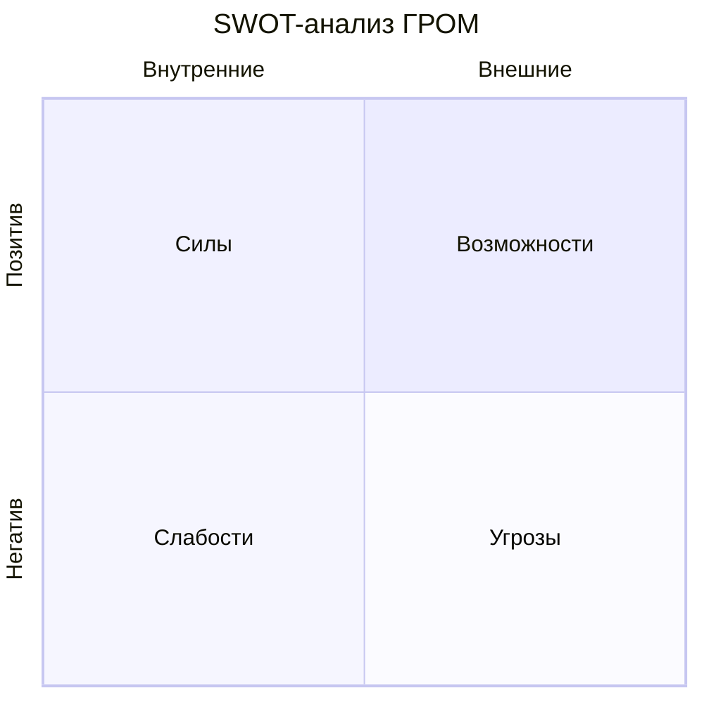
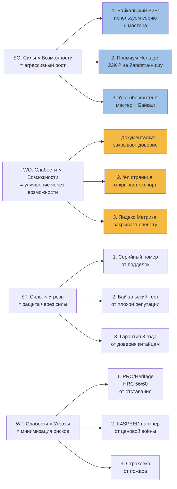

# ⚖️ SWOT-анализ ГРОМ

> **Дата:** 02.07.2026
> **Метод:** экспертный анализ на основе [[Competitor-Matrix]], [[Baikal-Market]], [[Pricing-Model]], [[Customer-Journey]], [[Research-Plan]].

---

## 🎯 1. Сводная матрица

| | **Позитивные** | **Негативные** |
|---|---|---|
| **Внутренние** | **Strengths (Силы):** • 🇷🇺 Единственный серийный производитель в РФ • 📍 Ангарск → 250 км до Байкала • 🔖 Серийный номер на изделии • 🎬 Открытый производственный процесс • 📜 HRC открыто • 💬 109 отзывов, рейтинг 5.00 • ⭐ Байкальская идентичность | **Weaknesses (Слабости):** • 📉 Слабый поиск (44–91 запрос/мес) • 🏪 Нет дистрибуции (только сайт + Авито) • 📊 Нет данных Метрики (P0) • 🎥 Нет видео производства • 🔧 HRC 50 (vs Zandstra 60) • 🛒 Нет экосистемы (крепления, аксессуары) • 🌐 Нет EN-страницы • 👶 Нет детской линейки |
| **Внешние** | **Opportunities (Возможности):** • 📈 Рынок растёт: +73 объявления на Авито за 30 дней • 🏔 Байкал: 2.4 млн поездок/год, +25% • 🌍 Экспорт wild ice skating (€€€) • 🎥 YouTube wild ice = бесплатный маркетинг • 🤝 B2B-туроператоры без своего проката • 💎 Премиум-сегмент (Zandstra 22 990₽) свободен | **Threats (Угрозы):** • ⚔️ Zandstra / K4SPEED = прямой конкурент • 🇨🇳 ГОРAA 2 900₽ (китайский ширпотреб) • 💸 Слабая покупательская способность в РФ • 🌡 Глобальное потепление: короче зимний сезон • 📉 Санкции: сложности с импортом стали (ШХ15, Sandvik) • 🏔 Опасный дикий лёд (травмы → антипиар) |

---

## 💪 2. Strengths (Силы)

### 2.1. Географические и культурные

| Сила | Доказательство | Как используем |
|---|---|---|
| 🇷🇺 Российский производитель | ГРОМ в РФ — единственный серийный | слоган «Сделано в Ангарске» |
| 📍 Близость к Байкалу | 250 км от мастерской | тесты на реальном льду |
| 🎬 Открытое производство | мастер + цех (фото/видео) | контент в Telegram, YouTube |
| 🏔 Байкальская идентичность | 109 отзывов имиджево | продвижение через Drive2 |
| 🔖 Серийный номер | на каждом изделии | premium-сигнал |

### 2.2. Продуктовые

| Сила | Доказательство | Как используем |
|---|---|---|
| 📜 HRC открыто | указано на сайте 🟡 | маркетинговый козырь |
| 💪 HRC 50 (базовая) | лучше, чем у самодельных | преимущество в среднем сегменте |
| 🛠️ Лезвие 1.2 мм | стандарт для озёрного катания | совместимо с NNN/SNS |
| 🧰 Сервис + ремонт | мастерская в Ангарске | гарантия 3 года (план) |
| 🎁 6 SKU | готовая линейка | масштабируемо |

### 2.3. Маркетинговые

| Сила | Доказательство | Как используем |
|---|---|---|
| ⭐ Рейтинг 5.00 | 109 отзывов | сарафан, отзывы |
| 💬 Много отзывов | 109 (на Авито тоже) | социальное доказательство |
| 🏷 ГРОМ — узнаваем локально | поиск «ГРОМ Иркутск» | SEO-трафик |
| 📰 Упоминания в СМИ | Drive2, Авито, n-skater | вторичный контент |

---

## 🚨 3. Weaknesses (Слабости)

### 3.1. Маркетинговые

| Слабость | Влияние | Приоритет | Решение |
|---|---|---|---|
| Нет видео производства | турист не верит «ручной работе» | 🔴 P0 | Снять документалку 5–8 мин |
| Нет HRC на карточке | покупатель сравнивает только цену | 🔴 P0 | Добавить на все SKU |
| Нет мастера на сайте | анонимный производитель | 🔴 P0 | Добавить фото + имя |
| Нет отзывов на сайте | 109 на Авито, 0 на гром38.рф | 🟡 P1 | Импортировать отзывы |
| Нет EN-страницы | экспорт = 0 | 🟡 P1 | Сделать /en |
| Слабый Telegram | нет регулярного контента | 🟡 P1 | 3 поста/нед |

### 3.2. Продуктовые

| Слабость | Влияние | Приоритет | Решение |
|---|---|---|---|
| HRC 50 (низкий) | Zandstra 60, Lundhags 58 | 🟡 P1 | PRO 56, Heritage 60 |
| Лезвие 1.2 мм (тонкое) | Zandstra Competition 1.4 мм | 🟡 P1 | PRO 1.4 мм |
| Нет экосистемы | Zandstra: рюкзаки, палки, защита | 🟢 P3 | Комплект «Экспедиция ГРОМ» |
| Нет детской линейки | Zandstra Bobskate 70 (2 190₽) | 🟢 P3 | «ГРОМ-Юниор» 39–42 см |
| Нет креплений в комплекте | покупатель докупает +5 000₽ | 🟡 P1 | PRO: NNN в комплекте |
| Нет PRO/Heritage | портфолио неполное | 🔴 P0 | Запустить Q3 2026 |

### 3.3. Аналитические

| Слабость | Влияние | Приоритет | Решение |
|---|---|---|---|
| Нет Яндекс.Метрики | «слепая» система | 🔴 P0 | Подключить до 07.07.2026 |
| Нет WooCommerce данных | не знаем продажи | 🔴 P0 | Запросить у владельца |
| Нет email-базы | нельзя делать CRM | 🟡 P1 | Собирать email при заказе |
| Нет NPS-измерения | не знаем лояльность | 🟡 P1 | Опрос через 30 дней |

### 3.4. Дистрибуция

| Слабость | Влияние | Приоритет | Решение |
|---|---|---|---|
| Только сайт + Авито | 800 UV/мес (текущий) | 🔴 P0 | + K4SPEED, АльпИндустрия-Тур, Спорт-Марафон |
| Нет в outdoor-магазинах | 95% outdoor outdoor outdoor проходит мимо | 🔴 P0 | Войти в 1–2 магазина до Q4 2026 |
| Нет в B2B-туроператорах | упускаем 30+ пар/зима | 🔴 P0 | АльпИндустрия-Тур: договор до 15.07.2026 |

---

## 🌍 4. Opportunities (Возможности)

### 4.1. Рынок

| Возможность | Объём | Срок | Усилие |
|---|---|---|---|
| Байкальский B2B-прокат | 110 пар × 6 500₽ = 715K ₽ | сезон 2026/2027 | низкое (1 КП) |
| Байкальский B2C-прокат (через турбазы) | 300 пар × 3 000₽/день × 5 дней = 4.5M ₽ | 2 года | среднее (5 турбаз) |
| Премиум-сегмент (Heritage 22K) | 50 пар/год × 22 000₽ = 1.1M ₽ | 1 год | среднее (PRO/Heritage) |
| Экспорт в ЕС | 50–100 пар/год × €100 = 0.5–1M ₽ | 3 года | высокое (CE) |
| Outdoor-магазины РФ | 30–100 пар/год через K4SPEED/Спорт-Марафон | 1 год | среднее |
| Детская линейка | 50 пар/год × 4 500₽ = 225K ₽ | 1.5 года | низкое (1 SKU) |

### 4.2. Контент

| Возможность | Охват | Срок | Усилие |
|---|---|---|---|
| YouTube-канал производство | 5–50K просмотров/видео | 1 год | среднее (снять 6 видео) |
| YouTube wild ice (партнёрство) | 100–500K просмотров/обзор | 2 года | низкое (Michaela Carrot) |
| Telegram outdoor | 3–10K подписчиков/год | 1 год | низкое (3 поста/нед) |
| VK outdoor outdoor | 5–15K подписчиков | 1.5 года | низкое |
| Drive2-экспертность | 10–30K просмотров/пост | 1 год | среднее (6 постов) |

### 4.3. Стратегические

| Возможность | Эффект | Срок |
|---|---|---|
| Тренд на импортозамещение | Zandstra уходит из РФ? | 1–3 года |
| Экологический outdoor | «Handmade, ближе к природе» | постоянно |
| Крафтовый outdoor | «Handmade в России» = тренд | постоянно |
| Туризм Байкала (+25%) | ×3 за 5 лет | 5 лет |

---

## ☠️ 5. Threats (Угрозы)

### 5.1. Конкурентные

| Угроза | Вероятность 🟡 | Влияние | Защита |
|---|---|---|---|
| Zandstra / K4SPEED | низкая (уже на рынке) | высокое | дифференциация: серия, мастер, байкальский тест |
| Китайские копии (ГОРAA) | высокая | среднее | не конкурировать в бюджете, уходить в средний+ |
| Скороходы (16 000₽) | средняя | среднее | быстрее, байкальский тест, PRO-сегмент |
| Самодельные мастера | высокая | низкое | премиум через серийный номер и гарантию |
| Wild skating бренды ЕС | низкая | высокое | экспорт сам в ЕС, а не конкуренция в РФ |
| Новые РФ-производители (2–3 за 2 года) | средняя | среднее | быть первым = удерживать имидж |

### 5.2. Макро

| Угроза | Вероятность 🟡 | Влияние | Защита |
|---|---|---|---|
| Слабый рубль | средняя | среднее | фокус на РФ-покупателя |
| Кризис outdoor | средняя | высокое | средний сегмент (7 800₽) устойчив |
| Глобальное потепление | высокая (через 10 лет) | высокое | летние категории (ролики) к 2030 |
| Санкции на сталь (ШХ15, Sandvik) | низкая | высокое | освоить аналоги (9ХС, ХВГ) |
| Закрытие outdoor outdoor | низкая | высокое | диверсификация: прокат, B2B |

### 5.3. Репутационные

| Угроза | Вероятность 🟡 | Влияние | Защита |
|---|---|---|---|
| Травма на байкальском льду | средняя | высокое | инструкции по безопасности, пешни в комплекте |
| Пожар в мастерской | низкая | критическое | страховка, пожарная безопасность |
| Антипиар в СМИ | низкая | высокое | прозрачность, открытый мастер |
| Брак в серии | низкая | среднее | тройной контроль качества |

---

## 📊 6. Матрица стратегий (TOWS)

---

## 🗺️ 7. Приоритетный план действий

### S1–S3: Агрессивный рост

| # | Действие | Срок | Стоимость | Эффект |
|---|---|---|---|---|
| 1 | КП в АльпИндустрию-Тур (Андрей Щёкотов) | до 15.07.2026 | 0 | 30 пар/зима (195K ₽) |
| 2 | Запуск PRO-линейки (3 SKU) | до 15.08.2026 | 200K ₽ | +50% выручки |
| 3 | YouTube-канал «ГРОМ: сделано в Ангарске» | до 01.09.2026 | 50K ₽ | 5K подписчиков/год |
| 4 | Heritage-линейка (50 пар) | до 01.11.2026 | 200K ₽ | +1.1M ₽/год |

### W1–W3: Улучшение

| # | Действие | Срок | Стоимость | Эффект |
|---|---|---|---|---|
| 5 | Снять документалку производства (5–8 мин) | до 01.08.2026 | 30K ₽ | конверсия +30% |
| 6 | Добавить HRC + мастера + серию на сайт | до 10.07.2026 | 0 | доверие ↑ |
| 7 | Сделать /en страницу | до 15.09.2026 | 50K ₽ | экспорт-трафик |
| 8 | Подключить Яндекс.Метрику + CRM | до 07.07.2026 | 5K ₽ | видимость данных |

### ST1–ST3: Защита

| # | Действие | Срок | Стоимость | Защита |
|---|---|---|---|---|
| 9 | Серийный номер + паспорт на каждое изделие | до 15.07.2026 | 5K ₽ | от подделок |
| 10 | Видео-инструкция по безопасности на льду | до 01.08.2026 | 5K ₽ | от травм |
| 11 | 3-летняя гарантия в открытом доступе | до 15.07.2026 | 0 | от недоверия |

### WT1–WT3: Минимизация рисков

| # | Действие | Срок | Стоимость | Защита |
|---|---|---|---|---|
| 12 | PRO HRC 56, Heritage HRC 60 | до 15.08.2026 | 100K ₽ (PVD) | от отставания |
| 13 | Договор с K4SPEED как оптовик | до 15.09.2026 | 0 | от ценовой войны |
| 14 | Страховка мастерской | до 01.08.2026 | 30K ₽/год | от пожара |

---

## 📈 8. Прогноз на 3 года

| Метрика | Сейчас | +1 год | +2 года | +3 года |
|---|---|---|---|---|
| Выручка | 1.2–2.5М ₽ | 2.7М ₽ | 4.4М ₽ | 6.9М ₽ |
| Маржинальность | 45% | 47% | 50% | 52% |
| Число SKU | 6 | 12 (PRO+Heritage) | 16 (+Юниор) | 20 (+аксессуары) |
| Каналы | 2 (сайт, Авито) | 5 | 8 | 12 |
| Сотрудников | 1 (мастер) | 1 + 1 (помощник) | 2 + ассистент | 3 + менеджер |
| География | Иркутск | + Москва/СПб | + Байкал B2B | + экспорт ЕС |

---

## 🎯 9. Топ-3 риска и их митигация

| Риск | Вероятность 🟡 | Удар | Митигация |
|---|---|---|---|
| Zandstra снизит цену до 13 000₽ (война) | низкая | критическое | фокус на B2B Байкал, дифференциация через мастера |
| ГРОМ не получит данные Метрики | средняя | высокое | работаем по гипотезам, считаем по Авито |
| Байкальский сезон 2026/2027 отменится (тёплая зима) | средняя | среднее | диверсификация: средний сегмент, outdoor outdoor |

---

## 🔗 Связанные документы

- [[Competitor-Matrix]] — детальная таблица конкурентов
- [[Baikal-Market]] — Байкальский рынок
- [[Pricing-Model]] — P&L по линейке
- [[Customer-Journey]] — путь покупателя
- [[Research-Plan]] — гипотезы
- [[TRIZ-Strategy]] — стратегия

## 🏷 Теги

`#swot` `#tows` `#strategy` `#strengths` `#weaknesses` `#opportunities` `#threats` `#grom` `#plan` `#risk-management`

---

_Создано: 02.07.2026. Основа: [[Competitor-Matrix]], [[Baikal-Market]], [[Pricing-Model]], [[Customer-Journey]], [[Research-Plan]]. Все оценки вероятностей и влияний — экспертные, помечены 🟡._
