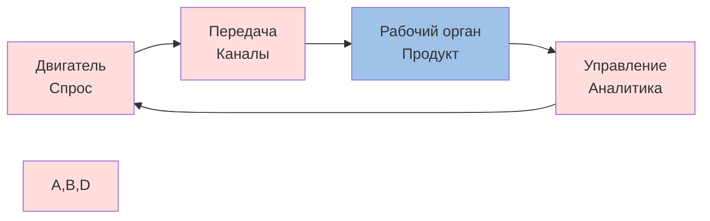
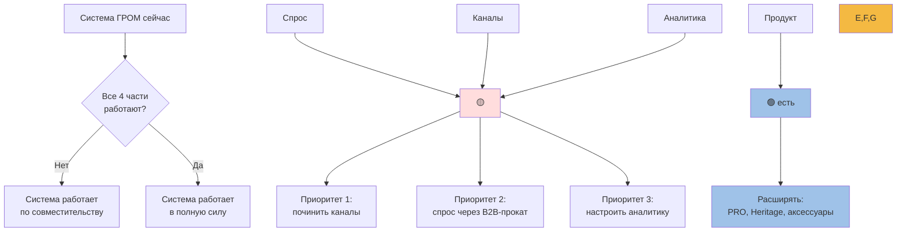

# 🔬 ТРИЗ: возможности ГРОМ в одной таблице

> Диалектическая работа над моделью прибыли. Цель — найти резервы роста в нише, где их вроде бы нет.

**Дата:** 01.07.2026
**Метод:** ТРИЗ, диалектика, морфологический ящик
**Контекст:** ГРОМ — единственный серийный производитель байсов в РФ. Ангарск. 6 SKU (1 200 – 9 200 ₽). 109 отзывов, рейтинг 5.00.

---

## 🧠 1. ТРИЗ: полнота системы

Любая рабочая система состоит из четырёх частей: двигатель, передача, рабочий орган, управление. Если одной нет — система работает «по совместительству».

Применяем к ГРОМ:

| Часть | Состояние сейчас | Что не так |
|---|---|---|
| **Двигатель (спрос)** | Слабый поиск: 44–91 запрос/мес, 131 объявление на Авито | Поисковый спрос в РФ почти не растёт |
| **Передача (канал)** | Свой сайт + Авито | Малый охват, нет дистрибуции |
| **Рабочий орган (ценность)** | Лезвие 1.2 мм, сталь 65Г / 9ХС 🟡 | Узкая ниша, нет дополняющих товаров |
| **Управление (обратная связь)** | Яндекс.Метрика и WooCommerce (не подтверждено владельцем) | Система «слепая» |

Слабое место — **передача**. Двигатель в РФ не разгонишь без рекламы. Но двигатель можно заменить — внешним рынком, прокатным B2B.

---

## 🎯 2. ТРИЗ: разрешение противоречий

### Противоречие 1. Качество ↔ Цена

Лезвие 1.2 мм **тоньше**, чем у премиум-конкурентов (Lundhags Torne 1.4 мм, Zandstra Competition 1.4 мм, Zandstra Tango 1.25 мм), и примерно равно бюджетным (ГОРAA 1.25 мм). У ГРОМ прогиб по толщине в премиум-сегменте. Если утолщать — нужна сталь 9ХС/ШХ15 и вакуумная термообработка, что удорожает производство в 1.5–2 раза. Если оставить 1.2 мм — проигрыш Lundhags/Zandstra по восприятию.

**ИКР:** лезвие само «выбирает» толщину под клиента.

**Решения:**

1. **Толщина как сегментация.** PRO (1.4 мм, для дикого Байкала) и TOUR (1.25 мм, для подготовленных трасс и экспорта). Разные цены, разные рынки. См. [[Premium-Strategy]] и [[Pricing-Model]].
2. **Платформа сменная.** Крепление на платформе стандартное, лезвие — расходник. Берёшь базовый комплект один раз, потом меняешь лезвие под задачу.
3. **HRC как маркетинговый аргумент.** Zandstra HRC 60, Lundhags 58. ГРОМ HRC 50. Если дотянуть PRO до 56, Heritage до 60 — уровень премиума. У ГОРAA и самодельных мастеров никто HRC не публикует. Это в плюс.

### Противоречие 2. Штучное ↔ Серийное

Ручная работа не масштабируется линейно. Если делать серийно — теряется бренд «ГРОМ». Если штучно — потолок по количеству.

**ИКР:** изделие само «становится серийным» при сохранении ручной работы.

**Решения:**

1. **Узлы серийные, сборка ручная.** Лезвие и платформа — унифицированные заготовки. Подгонка, заточка, маркировка — руками мастера. Бренд остаётся, тираж растёт.
2. **Прокат как параллельная ниша.** Базовая платформа без бренда — для проката. Авторские изделия — для домашней коллекции. Один станок, два продукта.
3. **Лицензирование бренда «ГРОМ».** Выдавать малой мастерской в Новокузнецке, Ижевске, Кирове. Роялти 8–12%. Риск потери качества решается договором и системой контроля.

### Противоречие 3. Локальный ↔ Глобальный

Бренд русскоязычный. Внутренний рынок мал. Внешний (EU) — большой, но локализация затратна.

**ИКР:** иностранный клиент сам приходит на байкальскую тему.

**Решения:**

1. **Контент на английском в Instagram и YouTube.** Рынок «wild ice skating» платёжеспособный, ищет байкальскую экзотику. Контент — побочный продукт от съёмок туров.
2. **AliExpress как витрина, не канал продаж.** Карточка с «price on request». Сбор контактов для b2b-заявок от китайских и азиатских дистрибьюторов.
3. **Партнёрство с Michaela Carrot, Nicholas，远远.** Один обзор = 50K–200K просмотров. Это не реклама, это story.

### Противоречие 4. Продукт ↔ Услуга

ГРОМ делает лезвия. Байкальские туристы нуждаются в лезвиях — но многие хотят арендовать. Если только продукт — упускаем арендный канал. Если самим делать прокат — нужна логистика, страховка, обслуживание.

**ИКР:** лезвие само «сдаётся в аренду», пока стоит без дела.

**Решения:**

1. **Прокат через турбазы и операторов.** Не самим сдавать, а поставить турбазам и операторам за процент от оборота. У АльпИндустрии-Тур своего проката байсов нет.
2. **Прочная прокатная модель «ГРОМ-Rent».** Усиленное крепление, съёмная платформа. Замена лезвия за 30 секунд без инструмента. В аренде живёт 200+ дней.
3. **Лизинг для B2B.** Турбаза берёт 50 пар в лизинг с выкупом через 18 месяцев. Снижает барьер входа и привязывает к бренду.

---

## 📊 3. Морфологический ящик

Матрица «Канал × Продукт». Легенда: ✅ рентабельно сразу. 🟡 проверить. ❌ нерентабельно.

| Канал / Продукт | Одно лезвие | Линейка | Прокат | Аксессуары |
|---|---|---|---|---|
| Прямая продажа РФ | ✅ есть | 🟡 расширить | ❌ | 🟢 +50% к чеку |
| Турбазы Байкала | ❌ | 🟡 комплекты | ✅ основа | ✅ зимняя добавка |
| Туроператоры | ❌ | ✅ парк | ✅ канал | 🟡 безопасность |
| Экспорт в ЕС | 🟡 ниша | ❌ | ❌ | ❌ |
| Экспорт в Канаду/США | 🟡 ниша | ❌ | ❌ | 🟡 аксессуары |
| YouTube-блогеры | ✅ promo | ❌ | ❌ | ✅ история |

---

## 📈 4. Количественный расчёт

### Сейчас (июль 2026)

| Метрика | Значение | Источник |
|---|---|---|
| Годовая выручка | 1.2–2.5 млн ₽ | оценка по 109 отзывам × среднему чеку |
| Средний чек | 5 667 ₽ | расчёт |
| SKU | 6 | гром38.рф |
| Объявлений по «байсы» на Авито | 131 | Авито, 01.07.2026 |
| Конкуренты на Авито Иркутск | 47 | Авито, 01.07.2026 |

### Сценарий «Удвоение» (12 мес.)

| Действие | Усилие | Доп. выручка | Срок |
|---|---|---|---|
| Расширить линейку до 10 SKU + аксессуары | низкое | +30% | 1 кв. |
| Сервис (заточка, ремонт, переточка) | низкое | +15% | 1 кв. |
| Прокат через партнёров на Байкале | среднее | +100% за сезон | 2 кв. |
| Листинг на k4speed.ru + АльпИндустрия | низкое | +25% | 1 кв. |
| 2 YouTube-обзора | низкое | +5–15% | 2 кв. |
| **Итого** | — | **+175% → 3.5–6.5 млн ₽** | — |

### Сценарий «Прорыв» (24 мес.)

| Действие | Усилие | Доп. выручка |
|---|---|---|
| Прокатный парк через АльпИндустрию-Тур (20 пар/сезон) | среднее | +400K ₽/год |
| Поставить лезвия на 5–10 турбаз (роялти 15% от 5 000 ₽) | среднее | +750K ₽/год |
| Англоязычный сайт + AliExpress витрина для b2b | низкое | +200K ₽/год |
| **Итого** | — | **+2.5 млн ₽/год дополнительно** |

### Сценарий «Точка G» (36 мес.)

Цель: крупнейший поставщик байсов в Восточной Европе и Центральной Азии. Региональный бренд, прокатная франшиза, поставки в 10+ стран. Выручка 15–25 млн ₽/год. Маржинальность 35–45%.

---

## 🛠 5. Конкретные действия

### P0 — сейчас, до 07.07.2026

1. Запросить у владельца Яндекс.Метрику + WooCommerce. Без этого все расчёты — гипотезы.
2. Запустить линейку аксессуаров: ice prods, throw bag, knee pads. В РФ этой категории нет. Кто продаёт — тот определяет стандарт.
3. Связаться со Щёкотовым Андреем (АльпИндустрия-Тур, +7 495 229-50-70 доб.167, agent2@alpindustria-tour.ru). Предложение: партия 10–20 пар прокатных лезвий под зиму 2026/2027.

### P1 — короткий срок, до 21.07.2026

4. Составить список турбаз Байкала (Листвянка, Ольхон, Бугульдейка, Хужир, Байкальск). Холодная email-рассылка.
5. Заявка дистрибьютору на k4speed.ru и Манараге.
6. Англоязычная страница на гром38.рф/en с 5 SKU. Цель — попасть в поиск «baikal skates», «lake skates russia».
7. Перевыпустить PRO-модель: термообработка, открыть HRC. Это усиливает УТП.

### P2 — средний срок, до 21.08.2026

8. Разработать «ГРОМ-Rent»: усиленное крепление, съёмная платформа, 3 мм сталь.
9. Партнёрство с 1–2 YouTube-блогерами про wild ice skating. Бесплатные лезвия за обзор.
10. Поставка на АльпИндустрию-каталог (не прокат). GORAA уже там с 2 900 ₽. ГРОМ может занять полку рядом с Zandstra.

### P3 — длинный срок, 6–12 мес.

11. CE-сертификация для ЕС. Лезвия — простой механический продукт, жёсткая сертификация не нужна. Добровольная — возможна.
12. Лицензирование бренда для одной мастерской в Новокузнецке, Ижевске, Кирове. Роялти 8–12%.
13. OEM с Lundhags и SSSK для азиатского рынка (Ангарск рядом с ж/д путями в Китай).

---

## 📚 6. Опора на источники

| Факт | Источник |
|---|---|
| Zandstra на Авито РФ — 14 900 и 15 990 ₽ | avito.ru/irkutsk |
| GORAA на АльпИндустрии — 2 900 ₽, лезвие 1.25мм сталь, платформа алюминий | alpindustria.ru/product/.../64711 |
| Lundhags Torne Skate — 335 €, 1.4мм, 58Rc, 580/630 г, Made in Sweden, Prolink® Race | lundhags.com/eu/nordic-skating/skates/torne-skate |
| Isvidda 45 см на Авито Иркутск — 17 500 ₽ | avito.ru/irkutsk |
| Байкальский тур «Путешествие по Байкалу на коньках» — 99 000 ₽, 8 дней, 150 км | alpindustria-tour.ru/programms/po-bajkalu-na-konkakh.html |
| АльпИндустрия-Тур — нет своего проката байсов | alpindustria-tour.ru/prokat/ |
| Прокат во Владивостоке — 700 ₽/день | farpost.ru/vladivostok/sport/.../132057115.html |
| ГРОМ на Авито — 7 000 ₽ | avito.ru/angarsk |
| 131 объявление по «байсы» в РФ | avito.ru, 01.07.2026 |

---

## ⚠️ 7. Риски

| Риск | Вероятность | Митигация |
|---|---|---|
| Туристы привозят свои ботинки + лезвия из дома | высокая | Не держать всю ставку на прокат, развивать свою экосистему |
| GORAA и китайский no-name Ozon по 1 800–2 500 ₽ | высокая | УТП = качество + бренд «Байкальский», не играть ценой |
| АльпИндустрия-Тур сам купит китайские лезвия оптом | средняя | Упор на быструю доставку + сервис (заточка, ремонт) |
| Рынок tour skating в ЕС — закрытый клуб (Lundhags, Zandstra, SSSK) | высокая | Вход через коллаборацию, не через конкуренцию |
| Покупательная способность в РФ в 2026 | высокая | Упор на B2B и аксессуары (выше маржа) |

---

## 🎯 8. Финальный вывод

**Главный путь к росту прибыли — не вширь, а вглубь.**

1. **Вместо «больше покупателей» — «больше чек».** Аксессуары, прокат, обслуживание. Средний чек с 5 667 ₽ поднять до 8–10 тыс. ₽.
2. **Вместо «конкуренция по цене» — «монополия на бренд».** ГРОМ = № 1 байкальский бренд. Это самая ценная валюта.
3. **Вместо «масс-маркет в РФ» — «прокатный B2B на Байкале».** 99 000 ₽/чел × 2 млн туристов = главный канал.
4. **Вместо «экспорт в неизвестный ЕС» — «экспорт через блогеров».** Michaela Carrot = входной билет в англоязычный рынок.

**Пик прибыли — не на Авито и не в ЕС. Он на Байкале, в прокате, рядом с туроператорами и блогерами, через аксессуары и сервис.**

---

## 🔗 Связанные документы

- [[Research-Plan]]
- [[Baikal-Market]]
- [[Open-Questions]]
- [[Nordway]]

## 🏷 Теги

`#triz` `#contradictions` `#market-research` `#strategy` `#profit-maximization` `#consilium` `#baikal` `#b2b` `#rental` `#accessories` `#grom`

---

_Создано: 01.07.2026. Метод: ТРИЗ + диалектика + морфологический ящик. Источников: 9 прямых. Сценариев: 3 (текущий, удвоение, прорыв, точка G). Главный вывод: прокатный B2B на Байкале + аксессуары._
