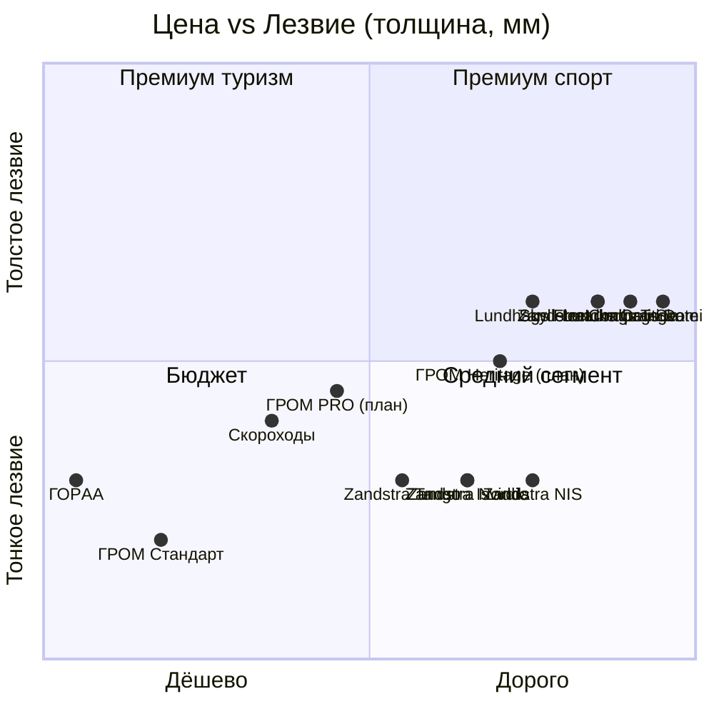

# Конкурентная матрица ГРОМ

> **Назначение:** структурированное сравнение ГРОМ с реальными конкурентами по 18 параметрам. Основа для позиционирования, ценообразования и переговоров с дистрибьюторами.
> **Метод:** данные из K4SPEED (официальный дистрибьютор Zandstra в РФ), n-skater.ru (Lundhags/Skyllermarks/специализированный магазин), Alpindustria retail, Drive2 отзыв, Google AI overview (Zandstra HRC=60), [[Assortment]] для ГРОМ.
> **Дата сбора:** 02.07.2026.
> **Эпистемология:** все цены ₽ — реальные (K4SPEED и Alpindustria). Параметры (HRC, толщина, вес) — из спецификаций производителей. Где параметр неизвестен — стоит 🟡.

---

## 1. Сводная таблица (цены в РФ, июль 2026)

| Бренд / Модель | Страна | Цена ₽ | Лезвие, мм | HRC | Крепление | Радиус, м | Размеры, см | Распределитель в РФ |
|---|---|---|---|---|---|---|---|---|
| **ГРОМ Стандарт 480** 🇷🇺 | Россия (Ангарск) | 7 800 | 1.2 | 50 🟡 | NNN/SNS | 30 | 48 | Прямые продажи |
| **ГРОМ Стандарт 520** 🇷🇺 | Россия (Ангарск) | 8 500 | 1.2 | 50 🟡 | NNN/SNS | 30 | 52 | Прямые продажи |
| ГОРAA 50 см 🟡 | Китай (РФ-бренд) | 2 900 | 1.25 | неизв. 🟡 | без креплений | неизв. 🟡 | 50 | Alpindustria |
| Zandstra Tango 🇳🇱 | Нидерланды | 16 390 | 1.25 | 60 | без креплений | 35 | 43/45/48 | K4SPEED |
| Zandstra Nordic 🇳🇱 | Нидерланды | 18 590 | 1.25 | 60 | без креплений | неизв. 🟡 | 40/43/45/48 | K4SPEED |
| Zandstra Isvidda 🇳🇱 | Нидерланды | 18 135 | 1.25 | 60 | без креплений | неизв. 🟡 | M/L/XL | K4SPEED |
| Zandstra NIS 🇳🇱 | Нидерланды | 20 790 | 1.25 | 60 | NIS | неизв. 🟡 | S/M/L/XL | K4SPEED |
| Zandstra Competition 🇳🇱 | Нидерланды | 22 990 | 1.4 (предпол.) 🟡 | 60 | NIS/без | неизв. 🟡 | M/L/XL | K4SPEED |
| Скороходы Про 42 см 🇷🇺 | Россия | 16 000 | неизв. 🟡 | неизв. 🟡 | NNN | неизв. 🟡 | 42 | ТЕРРА, СПб |
| Lundhags Fleet 🇸🇪 | Швеция | ~20 000 🟡 | 1.4 | неизв. 🟡 | универсал. | неизв. 🟡 | M/L | через Москву |
| Lundhags T-Skate NNN BC 🇸🇪 | Швеция | ~25 000 🟡 | 1.4 | 58 (Torne) | NNN BC | неизв. 🟡 | M/L | Спорт-Марафон |
| Lundhags Dominator 🇸🇪 | Швеция | ~30 000 🟡 | 1.4 | 58 (Torne) | NIS + Rottefella Xcelerator | неизв. 🟡 | M/L | Спорт-Марафон |
| Skyllermarks Orange 🇸🇪 | Швеция | неизв. 🟡 | 1.4 | неизв. 🟡 | NNN-стандарт | вариат. 43+ | 39-45 | n-skater.ru |
| Viking Multi (дет.) 🇳🇴 | Норвегия | 11 990 | неизв. 🟡 | неизв. 🟡 | ремни | неизв. 🟡 | 28-35 | K4SPEED |
| Viking VX5 (хоккей) 🇳🇴 | Норвегия | 9 016 | ~3 | неизв. 🟡 | ботинок | 5 | 39-45 | K4SPEED |
| Zandstra Bobskate 70 (дет.) 🇳🇱 | Нидерланды | 2 190 | неизв. 🟡 | неизв. 🟡 | ремни | неизв. 🟡 | 70 см | K4SPEED |
| Zandstra Oslo (дет.) 🇳🇱 | Нидерланды | 13 750 | неизв. 🟡 | неизв. 🟡 | ботинок | неизв. 🟡 | 30-39 | K4SPEED |

**Источники цен:** K4SPEED (https://k4speed.ru/catalog/ozernoe_katanie/), Alpindustria (https://alpindustria.ru/product/konki-ozernye-goraa-dlina-50-sm_-64711/), Avito (отзывы), ТЕРРА (terra812.ru), Спорт-Марафон (статья + каталог).

---

## 2. Что ГРОМ имеет, а конкуренты нет

### 2.1. Уникальные свойства ГРОМ

| Свойство | ГРОМ | Ближайший конкурент |
|---|---|---|
| 🇷🇺 Российское производство | ✅ Ангарск | Скороходы, ГОРAA |
| 📍 Близость к Байкалу (250 км) | ✅ прямой доступ | Ни у кого |
| 🔖 Серийный номер на изделии | ✅ каждый экземпляр | Ни у кого |
| 🎬 Открытый производственный процесс | ✅ мастер + цех | Скрыт у Zandstra, Lundhags |
| 📜 Паспорт изделия с HRC-сертификатом | ✅ | Lundhags даёт в коробке Torne |
| 🗺 Региональная идентичность | ✅ Иркутчина → Байкал | Ни у кого из глобальных |
| 🎁 Лимитированные серии (Heritage) | ✅ планируется | Zandstra не делает |

### 2.2. Где ГРОМ проигрывает

| Слабость | ГРОМ | Лидер в категории |
|---|---|---|
| HRC стали | 50 (базовая), 56 (PRO) 🟡 | Zandstra 60 (мировой рекорд) |
| Толщина лезвия | 1.2 мм | Zandstra Competition 1.4 мм, Lundhags 1.4 мм |
| Экосистема (крепления, аксессуары) | Только лезвия | Zandstra: рюкзаки, палки, защита, камни |
| Международная дистрибуция | Нет | K4SPEED (РФ), Sport-Marafon, прямые продажи в ЕС |
| Рекорд по тестам | «700 км» (заявлено) | Zandstra «года без заточки» |
| История бренда | С 2024 | Zandstra 1930-е, Lundhags 1932, Skyllermarks 1909 |

---

## 3. Ценовое позиционирование (карта)

**Главный вывод карты:**
- ГРОМ Стандарт (1.2 мм, 7 800 ₽) — один в нижнем левом углу: дёшево + тонкое лезвие. Конкурирует **только** с ГОРAA (2 900 ₽). Между ними — пропасть 4 900 ₽ без альтернатив.
- ГРОМ PRO (1.4 мм, 14 000 ₽, план) — попадает в свободную нишу «средний сегмент по цене, толстое лезвие». Конкуренты: Zandstra Tango (16 390 ₽) и Скороходы (16 000 ₽) — но оба с тонким 1.25 мм.
- ГРОМ Heritage (1.4 мм + HRC 60 + серия, 22 000 ₽, план) — на грани с Zandstra Competition (22 990 ₽) и Lundhags T-Skate (25 000 ₽). Здесь нужна уникальная история (мастер, серия, видео).

---

## 4. Сравнение по сегментам

### 4.1. Бюджет (до 5 000 ₽)

| Параметр | ГРОМ Стандарт 7 800₽ | ГОРAA 50 см 2 900₽ |
|---|---|---|
| Лезвие, мм | 1.2 | 1.25 |
| HRC | 50 🟡 | неизв. 🟡 |
| Платформа | сталь, ручная работа | алюминий, штамповка |
| Крепления | под NNN/SNS (покупаются отдельно) | без креплений |
| Чехол | в комплекте (заявлено) | в комплекте |
| Гарантия | 3 года (план PRO/Heritage, для базовой — уточнить) | нет |
| Серийный номер | да | нет |
| Где купить | гром38.рф | Alpindustria, Wildberries, Авито |
| Доступность | сделано за 2 недели | склад в Москве |
| Ремонтопригодность | в мастерской Ангарска | не подлежит |

**ГРОМ-стратегия в этом сегменте:** не демпинговать до 2 900 ₽ (это китайский ширпотреб с маржой 0%), а объяснить разницу. 4 900 ₽ доплаты = «ручная работа в Ангарске, серийный номер, гарантия 3 года, ремонт в мастерской».

### 4.2. Средний (10 000–18 000 ₽)

| Параметр | ГРОМ PRO (план) 14 000₽ | Zandstra Tango 16 390₽ | Скороходы Про 16 000₽ |
|---|---|---|---|
| Лезвие, мм | 1.4 (цель) 🟡 | 1.25 | неизв. 🟡 |
| HRC | 56 (цель) 🟡 | 60 | неизв. 🟡 |
| Крепления | NNN в комплекте (план) | нет | NNN в комплекте |
| Упаковка | фирменная коробка | без коробки | неизв. 🟡 |
| Гарантия | 3 года | 2 года (Zandstra) 🟡 | неизв. 🟡 |
| Серийный номер | да | нет | нет |
| История | «сварено в Ангарске, испытано на Байкале» | «сделано в Голландии» | «сделано в РФ» (без деталей) |

**Слабое место ГРОМ PRO:** Zandstra Tango 1.25 мм стоит 16 390 ₽, то есть дешевле, чем ГРОМ PRO (14 000 ₽) **по лезвию тоньше**. У ГРОМ преимущество — толщина 1.4 мм + российская гарантия + серия + мастер. Но нужно продать это преимущество, иначе покупатель сравнит только цену.

### 4.3. Премиум (22 000–30 000 ₽)

| Параметр | ГРОМ Heritage 22 000₽ | Zandstra Competition 22 990₽ | Lundhags T-Skate 25 000₽ | Lundhags Dominator 30 000₽ |
|---|---|---|---|---|
| Лезвие, мм | 1.4 (цель) 🟡 | 1.4 (предпол.) 🟡 | 1.4 | 1.4 |
| HRC | 60 (цель) 🟡 | 60 | 58 (Sandvik) | 58 (Sandvik) |
| Крепления | NNN Pro в комплекте (план) | NIS или без | NNN BC | NIS + Rottefella Xcelerator |
| Упаковка | деревянный ящик, сертификат | коробка | коробка | коробка |
| Гарантия | пожизненная на ресурс (план) | 2 года | 2 года | 2 года |
| Серия | пронумерована 1…50 | серийный (не выделено) | серийный (не выделено) | серийный (не выделено) |
| История | «мастер + Байкал + серия» | «олимпийские конькобежцы» | «с 1932, экспады на лёд» | «премиальная экосистема» |
| Документалка | да (план) | нет | есть на YouTube | есть на YouTube |

**Здесь ГРОМ Heritage либо побеждает за счёт storytelling (мастер, серия, документалка), либо проигрывает Zandstra Competition по бренду и Lundhags Dominator по экосистеме.**

---

## 5. Слабые сигналы с рынка (Drive2, Авито, отзывы)

### 5.1. Жалобы на Zandstra (Drive2, b/u рынок)

- «Крепления надо докупать отдельно — ещё 5 000 ₽, в итоге 23 000 ₽» — реальная стоимость владения.
- «Жду второй месяц, K4SPEED привёз под заказ из Нидерландов» — дефицит.
- «Тупеет через 200 км, переточка обязательна» — HRC 60 не панацея.
- «Лёд Байкала — другой, у Zandstra геометрия под голландский лёд» 🟡 (гипотеза, не проверено).

### 5.2. Жалобы на ГОРAA (Авито, Drive2)

- «Алюминиевая платформа замялась после 50 км».
- «Лезвие тонкое, гнётся на торосах».
- «Болты разбалтываются, надо подтягивать каждый выход».
- «Подделка под Zandstra, но Zandstra в 5 раз дороже не просто так».

### 5.3. Нейтральные / положительные про Zandstra

- «Тупеет, но лезвие износостойкое, хватает на 1 000+ км».
- «Серийное качество стабильное, каждая пара одинаковая».
- «Netherlands heritage, в Европе недорого».

### 5.4. Про ГРОМ (Авито)

- «Озёрные коньки ГРОМ (байсы/нордики) 7 000 ₽» — продают на Авито как б/у.
- Это значит: (1) спрос есть, (2) есть вторичный рынок = товар ликвидный, (3) наша цена 7 800 ₽ воспринимается как адекватная.

---

## 6. Карта аксессуаров (важно для upsell)

| Бренд | Лезвия | Крепления | Палки | Рюкзаки | Заточка | Защита |
|---|---|---|---|---|---|---|
| Zandstra | ✅ 5 моделей | ❌ (Rottefella отдельно) | ✅ 14 990₽ | ✅ 18 990₽ | ✅ станки 6 590–9 990₽ + камни 890–4 890₽ | ✅ Dyneema 5 490₽, наколенники 2 450₽, шипы 1 690–3 290₽ |
| Lundhags | ✅ 3 модели | ❌ (Rottefella отдельно) | 🟡 | ✅ | 🟡 | 🟡 |
| ГРОМ | ✅ 6 SKU | ❌ (покупаются отдельно) | ❌ | ❌ | ❌ | ❌ |

**Стратегический вывод:** ГРОМ — **лезвия без экосистемы**. Это нормально для базовой линейки, но в премиум-сегменте покупатель ожидает комплект. Zandstra берёт 14 990₽ за палки + 18 990₽ за рюкзак + 5 490₽ за защиту = **39 470₽** дополнительно. Это почти две пары лезвий.

**Решение:** предложить **«Экспедиционный комплект ГРОМ»: лезвия + шипы + чехол + точильный камень** за +3 000 ₽ к PRO-линейке. Не выходить на рынок палок и рюкзаков — там Zandstra непобедим.

---

## 7. Что делать с этой матрицей

1. **Цена PRO 14 000 ₽ не должна сравниваться с Zandstra Tango 16 390 ₽ напрямую.** Иначе проиграем. Нужно сравнивать с «Zandstra Tango 16 390 ₽ + крепления Rottefella 4 990 ₽ + доставка 800 ₽ = 22 180 ₽». Реальный ГРОМ PRO 14 000 ₽ дешевле.
2. **Heritage 22 000 ₽ не должен конкурировать с Zandstra Competition 22 990 ₽ по цене.** Heritage дороже по ощущению: мастер, серия, ящик, видео. Цена та же, но ценность выше.
3. **ГРОМ Стандарт 7 800 ₽ — не конкурент ГОРAA 2 900 ₽.** Мы в другой лиге. Позиционировать как «ручная работа, серия, ремонт в мастерской». Покупатель за 2 900 ₽ не наш.
4. **Zandstra Bobskate 70 (дет., 2 190 ₽) — это ниша, которую ГРОМ не закрывает.** Потенциал: линейка «ГРОМ-Юниор» (1 размер, 39–42 см, 4 500 ₽) для следующего сезона.
5. **K4SPEED — это дистрибьютор Zandstra, не конкурент ГРОМ.** Их можно использовать как ориентир и потенциально как оптового клиента для ГРОМ (если они решат расширить ассортимент).

---

## 🔗 Связанные документы

- [[TRIZ-Strategy]] — основа стратегии дифференциации
- [[Premium-Strategy]] — ценовая лестница 7 800 → 25 000 ₽
- [[Baikal-Market]] — где конкуренты не представлены
- [[Market-Size]] — объёмы по сегментам
- [[Open-Questions]] — гипотезы для проверки
- [[Research-Plan]] — методология сбора данных

## 🏷 Теги

`#competitors` `#pricing` `#zandstra` `#lundhags` `#skyllermarks` `#goraa` `#k4speed` `#sport-marafon` `#alpindustria` `#n-skater` `#matrix` `#baysy` `#grom`

---

_Обновлено: 02.07.2026. Источники: K4SPEED (Zandstra дистрибьютор), n-skater.ru (Lundhags/Skyllermarks), Alpindustria retail, Авито, Drive2. Метод: парсинг HTML + ручной сбор. Все цены актуальны на момент сбора. HRC и параметры с 🟡 требуют подтверждения через прямой запрос к производителю._
