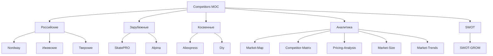

# 🔍 MOC Competitors (обновлено)

> Конкурентный анализ — план глубокого исследования

---

## 📂 Структура

---

## 📄 Страницы

### Прямые конкуренты
- [Nordway](04-Competitors/Nordway.md) — главный российский конкурент (гипотеза)
- [SkatePRO](04-Competitors/SkatePRO.md) — чешский премиум (гипотеза)
- [Izhevsk](04-Competitors/Izhevsk.md) — ижевские производители (гипотеза)

### Косвенные
- [Aliexpress-NoName](Aliexpress-NoName.md) — дешёвые аналоги (гипотеза)

### Аналитика (требует проверки)
- [Market-Map](04-Competitors/Market-Map.md) — карта рынка
- [Competitor-Matrix](04-Competitors/Competitor-Matrix.md) — сравнительная таблица
- [Pricing-Analysis](04-Competitors/Pricing-Analysis.md) — ценовой анализ
- [Market-Size](04-Competitors/Market-Size.md) — объём рынка РФ (НУЖНО ИССЛЕДОВАТЬ)
- [Market-Trends](04-Competitors/Market-Trends.md) — тренды зимнего outdoor (НУЖНО ИССЛЕДОВАТЬ)

### SWOT
- [SWOT-GROM](04-Competitors/SWOT-GROM.md) — SWOT-анализ ГРОМ (обновлено)

---

## 🎯 Что нужно УГЛУБИТЬ

### Гипотезы без подтверждения (⚠️)

| Гипотеза | Статус | Что делать |
|---|---|---|
| Nordway — главный конкурент | 🟡 гипотеза | Проверить: nordway.ru, ассортимент, цены |
| SkatePRO — премиум | 🟡 гипотеза | Проверить: skatepro.ru, наличие байсов |
| Цены Nordway 8 500-12 000 ₽ | 🟡 гипотеза | Нет источника |
| Цены SkatePRO 14 000-22 000 ₽ | 🟡 гипотеза | Нет источника |
| Объём рынка РФ | 🔴 нет данных | Запросить статистику |
| Байкал зимой +30% трафика | 🔴 нет источника | Запросить Яндекс.Wordstat |
| Outdoor-сообщества в TG готовы | 🟡 гипотеза | Проверить каналы |

### Что реально известно
- ✅ Ассортимент ГРОМ (6 SKU)
- ✅ Цены ГРОМ (1 200-9 200 ₽)
- ✅ Тех. характеристики ГРОМ (сталь 420, лазер ЧПУ)
- ✅ 109 отзывов на главный товар
- ✅ Schema.org заполнена

---

## 🔍 План глубокого исследования

### 1. Анализ nordway.ru (Россия)
- [ ] Ассортимент байсов и лезвий
- [ ] Цены
- [ ] UX сайта
- [ ] Категории и фильтры
- [ ] Отзывы
- [ ] Описания товаров
- [ ] Брендинг

### 2. Анализ skatepro.ru (Чехия)
- [ ] Ассортимент байсов
- [ ] Цены
- [ ] UX (мировой лидер)
- [ ] Чего у них нет для РФ

### 3. Анализ ижевских производителей
- [ ] Найти реальных производителей
- [ ] Цены
- [ ] Каналы продаж (Авито, форумы)

### 4. Анализ Aliexpress
- [ ] Топ-продавцы байсов
- [ ] Цены
- [ ] Качество (отзывы)

### 5. Анализ Telegram-сообществ
- [ ] outdoor-каналы
- [ ] рыболовные каналы
- [ ] лыжные сообщества
- [ ] аудитория, активность

### 6. Анализ VK-групп
- [ ] outdoor-сообщества
- [ ] рыбалка зимой
- [ ] Байкал-туризм

### 7. Анализ YouTube
- [ ] обзоры байсов
- [ ] катание на Байкале
- [ ] outdoor-обзоры

### 8. Яндекс.Wordstat
- [ ] «байсы купить» — частотность
- [ ] «озёрные коньки» — частотность
- [ ] «нордики» — частотность
- [ ] сезонность запросов

---

## 📊 Что считать «подтверждённым»

Гипотеза становится фактом, только если:
- ✅ Есть ссылка на источник (URL, документ)
- ✅ Есть цифра или факт (не оценка)
- ✅ Дата проверки указана

**Все цифры в файлах Nordway/SkatePRO/Izhevsk — гипотезы, требуют проверки.**

---

## 🔗 Связанные MOC

- [../01-Project/MOC-Project](01-Project/MOC-Project.md)
- [../03-Research/MOC-Research](03-Research/MOC-Research.md)
- [../06-Design/MOC-Design](06-Design/MOC-Design.md)
- [../02-Audit/Epistemic-Audit](02-Audit/Epistemic-Audit.md)

---

[⬅ Главная](00-Inbox/README.md)