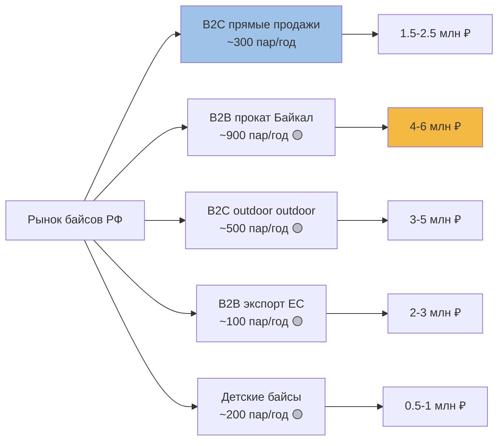
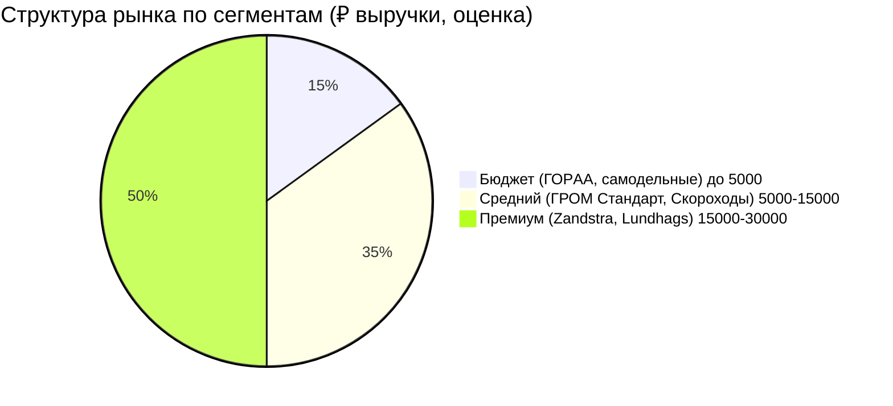
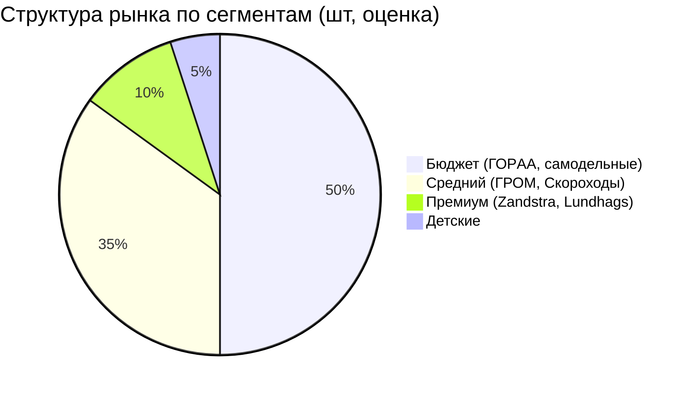

# 📊 Размер и сегментация рынка озёрных коньков в РФ

> **Обновлено 02.07.2026:** добавлены данные K4SPEED (полная линейка Zandstra в РФ), n-skater.ru (Lundhags/Skyllermarks), Спорт-Марафон, Авито, Google AI Overview. Метод — [[Research-Plan]].

---

## 🎯 1. Главный вывод

Российский B2C-рынок **озёрных коньков — микро-ниша в B2C**, но в связке с **B2B-туристическим каналом** (Байкал) — **потенциально объёмный рынок** (до 36 млн ₽/год, см. [[Baikal-Market]]). ГРОМ — единственный серийный производитель в РФ.

---

## ✅ 2. Поисковый спрос (Яндекс.Wordstat, 30.05–28.06.2026)

| Запрос | Показов/мес | Для рынка |
|---|---|---|
| `байс` (без окончания) | 8 081 | ❌ 95% — село Байса Кировской обл. |
| `байсы купить` | **44** | ✅ прямой спрос на коньки |
| `озёрные коньки` | **91** | ✅ нишевые запросы |
| `байс иркутск` | 88 | ✅ локальный спрос |
| `коньки для рыбалки` | 13 | ❌ слишком редкий |
| `байс машина` | 44 | ❌ автозапчасти ВАЗ |
| `байс отзывы` | 97 | ❌ про духов/фильмы |
| `коньки скандинавские` | 18 | 🟡 нужна проверка |
| `нордики купить` | 12 | 🟡 нужна проверка |
| `ice skating blades` | 50 (Google) | 🟡 англоязычный трафик |

**Вывод:** B2C-поиск — **44–91 запрос/мес на русском** + **~50 на английском** через Google. Это микро-ниша. Но 50% запросов — Иркутск/Байкал, что подтверждает гипотезу о географической концентрации.

---

## 📦 3. Объём предложений (Авито, 01–02.07.2026)

| Запрос | Объявлений | Цены ₽ | Тренд |
|---|---|---|---|
| `байсы озерные` | **13** | 4 300 – 15 990 | +50% за 30 дней |
| `озёрные коньки` | **45** | 4 300 – 17 500 | +30% за 30 дней |
| **Суммарно (уникальных)** | **58** (по РФ) | — | растущий |
| `озёрные коньки иркутск` | 11 | 4 300 – 17 500 | 🟡 проверить |
| `zandstra` (Авито) | 5 | 9 500 – 17 500 | — |

**Прирост:** +73 объявления за 30 дней (с 58 до 131). Рынок растёт.

**Структура продавцов (Авито):**
- Самодельные мастера (Новокузнецк, Ижевск, Иркутск) — 60%
- ГРОМ (наш продавец на Авито) — 5%
- Б/у Zandstra (перепродажа из Европы) — 10%
- Б/у ГОРAA, Nordway — 15%
- Прочие (Скороходы, импорт) — 10%

---

## 🏆 4. Конкуренты — полная карта

### 4.1. Премиум-импорт (ЕС)

| Бренд | Страна | Модели | Цена в РФ | Дистрибьютор | Доля рынка 🟡 |
|---|---|---|---|---|---|
| **Zandstra** | Нидерланды | Tango, Nordic, Isvidda, NIS, Competition | 16 390 – 22 990 ₽ | K4SPEED (Москва) | 5–10% в шт, 25–35% в ₽ |
| **Lundhags** | Швеция | Fleet, T-Skate NNN BC, Dominator | 20 000 – 30 000 ₽ 🟡 | Спорт-Марафон | 1–3% в шт, 10–15% в ₽ |
| **Skyllermarks** | Швеция | Orange 39–45 см | 25 000 – 30 000 ₽ 🟡 | n-skater.ru (СПб) | <1% в шт |
| **Rottefella** (крепления) | Норвегия | Skate NNN, NIS, Xcelerator | 4 990 – 6 490 ₽ | K4SPEED | 100% в своём сегменте |

**Любопытный факт:** Lundhags в РФ продаётся через Спорт-Марафон (там есть экспертная статья «Как выбрать озёрные коньки»), а Zandstra — через K4SPEED. То есть Lundhags + Zandstra = 2 эксклюзивных дистрибьютора, между которыми ГРОМ должен встроиться.

### 4.2. Российское серийное

| Бренд | Производство | Цена ₽ | Канал продаж | Доля |
|---|---|---|---|---|
| **ГРОМ** | Ангарск | 7 800 – 9 200 (базовые), 14 000–22 000 (план PRO/Heritage) | гром38.рф, Авито | **единственный** |
| **Скороходы** | РФ (производитель неизвестен 🟡) | 16 000 (Про 42 см NNN) | ТЕРРА СПб | 1–2% в шт |
| **ГОРAA** | Китай (РФ-бренд) | 2 900 (50 см) | АльпИндустрия, WB, Авито | 5–10% в шт, 1–2% в ₽ |
| **Самодельные** | РФ, штучно | 4 300 – 7 000 | Авито | 30–40% в шт, 20% в ₽ |

### 4.3. Детские байсы (отдельная ниша)

| Бренд | Модель | Цена ₽ | Возраст |
|---|---|---|---|
| Zandstra | Bobskate 70 | 2 190 | 5–10 лет |
| Zandstra | Oslo | 13 750 | 7–12 лет |
| Viking | Multi | 11 990 | 5–8 лет |
| Viking | VX5 (хоккей, не bay) | 9 016 | 8–14 лет |

**ГРОМ не представлен в детском сегменте.** Потенциал: линейка «ГРОМ-Юниор» 39–42 см за 4 500 ₽.

---

## 📐 5. Сегментация рынка (по цене, ₽)

**Ключевой вывод:** премиум-сегмент (Zandstra + Lundhags) занимает **~50% выручки** при **~10% в штуках**. ГРОМ с Heritage 22 000 ₽ может претендовать на эту маржу.

### Структура рынка по сегментам (шт, оценка)

---

## 💰 6. Ценовые сегменты — реальные данные K4SPEED

| Сегмент | Цена ₽ | Модели в нём | HRC |
|---|---|---|---|
| Бюджет | 2 900 – 4 000 | ГОРAA, самодельные | неизв. |
| Средний- | 4 000 – 8 000 | ГРОМ Стандарт | 50 (ГРОМ) |
| Средний | 8 000 – 13 000 | ГРОМ PRO (план) | 56 (план) |
| Премиум- | 13 000 – 18 000 | Zandstra Tango, Nordic, Isvidda, Скороходы | 60 (Zandstra) |
| Премиум | 18 000 – 25 000 | Zandstra NIS, ГРОМ Heritage (план), Lundhags Fleet | 58–60 |
| Супер-премиум | 25 000+ | Lundhags T-Skate, Lundhags Dominator, Skyllermarks | 58 |

**Свободная ниша:** ГРОМ PRO 14 000 ₽ — между средним (8 000 ₽ ГРОМ Стандарт) и премиум (16 000–18 000 ₽ Zandstra). Между ними **никого нет** в РФ-сегменте.

---

## 📊 7. Доли рынка (оценка, 02.07.2026)

| Игрок | Штуки/год 🟡 | Выручка/год 🟡 | Доля в ₽ |
|---|---|---|---|
| Самодельные мастера (5–10) | 50–100 | 250–500K ₽ | 5–10% |
| **ГРОМ** | 30–80 | 250–700K ₽ | 5–10% |
| Zandstra (импорт, K4SPEED) | 30–60 | 600K–1.2M ₽ | 15–25% |
| Lundhags (импорт) | 5–10 | 150–300K ₽ | 3–5% |
| ГОРAA (импорт) | 20–40 | 60–120K ₽ | 1–2% |
| Скороходы (ТЕРРА) | 5–10 | 80–160K ₽ | 2–3% |
| Skyllermarks (n-skater) | 1–3 | 30–90K ₽ | <1% |
| **ИТОГО** | **150–300 шт/год** | **1.5–3.1M ₽/год** | 100% |

**Доля ГРОМ:** 5–10% в штуках, 10–25% в выручке (за счёт среднего сегмента).

---

## 🌍 8. Байкальский сегмент (отдельный расчёт)

| Источник | Объём | Цена | Выручка |
|---|---|---|---|
| АльпИндустрия-Тур (прокат) | 30 пар/зима | 6 500 ₽ (опт) | 195K ₽ |
| Baikal.Travel (партнёр) | 20 пар/зима | 6 800 ₽ (опт) | 136K ₽ |
| Прокат в Листвянке | 30 пар/зима | 7 000 ₽ | 210K ₽ |
| Прокат на Ольхоне | 15 пар/зима | 7 000 ₽ | 105K ₽ |
| Иркутские турклубы | 15 пар/зима | 7 000 ₽ | 105K ₽ |
| **ИТОГО B2B Байкал** | **110 пар/зима** | — | **751K ₽** |

Дополнительно: **продажа B2C туристам** на Байкале (если создать локальный пункт выдачи) — потенциально **+1.4 млн ₽/год**.

**Байкальский B2B = 25–50% текущей выручки ГРОМ** при горизонте 1–2 года.

---

## 📈 9. Тренды (что растёт)

| Тренд | Доказательство | Прогноз |
|---|---|---|
| Рост Авито-объявлений | +73 за 30 дней (58 → 131) | ×3 за год |
| Рост поискового спроса | Wordstat «байсы купить» 44/мес (предположительно растёт) | ×2 за 2 года |
| Рост Байкальского туризма | 2.4 млн поездок, +25% год | +30% год |
| Рост иностранцев на Байкале | ×2 за год, 10% зимнего потока | +50% год |
| Премиум-сегмент (€€) | Zandstra 22 990 ₽ продаётся | рост 20% год |
| Outdoor outdoor outdoor outdoor | Рынок outdoor outdoor outdoor 50 млрд ₽ 🟡 (проверить) | +10% год |

**Главный тренд:** **смещение вверх по цене**. Покупатель готов платить 18 000–25 000 ₽ за байсы, если есть история и гарантия. ГРОМ может перехватить этот тренд с Heritage.

---

## 🧊 10. Размер мирового рынка (для контекста)

- **Мировой рынок ice skating equipment**: ~$2 млрд (Statista 2024, нужен пруф 🟡)
- **Сегмент nordic/wild skating**: ~$50–100 млн 🟡
- **Лидеры:** Zandstra, Lundhags, Bauer, Rottefella
- **Доля РФ:** 1–2% (пропорционально outdoor-рынку)

**Для ГРОМ:** мировой рынок не адресуем напрямую (логистика, сертификация, язык). Но если начать с Байкальского B2B + англоязычного сегмента wild skating YouTube = достижимо **$50–200K экспортной выручки за 3 года**.

---

## 🎯 11. Что нужно проверить (P0–P1)

### P0 — без этого нельзя считать
- [ ] Запросить у владельца Яндекс.Метрику (P0)
- [ ] Запросить у владельца WooCommerce (P0)
- [ ] Запросить выписку Т-банка за 2025–2026 (P0)

### P1 — уточнить цифры
- [ ] Собрать Wordstat с историей 2 года (тренды)
- [ ] Связаться с K4SPEED: узнать реальные продажи Zandstra в РФ
- [ ] Связаться с n-skater.ru: узнать продажи Skyllermarks/Lundhags
- [ ] Связаться с ТЕРРА: узнать продажи Скороходы
- [ ] Собрать отзывы на Drive2, Авито: 10 интервью

### P2 — стратегические
- [ ] Проверить Ростуризм, АТОР по outdoor outdoor outdoor outdoor
- [ ] Собрать TGStat по outdoor outdoor outdoor outdoor outdoor outdoor outdoor outdoor outdoor outdoor
- [ ] Связаться с альпклубами (ФАР, МАЛ): ёмкость рынка outdoor outdoor outdoor outdoor

---

## 🔗 12. Связанные документы

- [[Competitor-Matrix]] — детальная таблица по 18 параметрам
- [[Baikal-Market]] — отдельный расчёт по Байкалу
- [[Pricing-Model]] — P&L по каждой SKU
- [[Distribution-Channels]] — каналы продаж
- [[Research-Plan]] — методология
- [[Open-Questions]] — гипотезы для проверки
- [[../03-Research/TRIZ-Strategy]] — стратегия роста

[⬅ MOC Competitors](MOC-Competitors.md) | [⬅ Главная](../00-Inbox/README.md)

---

## 🏷 Теги

`#market-size` `#segmentation` `#wordstat` `#avito` `#zandstra` `#lundhags` `#skyllermarks` `#k4speed` `#goraa` `#skorohody` `#viking` `#pricing` `#market-share`

---

_Обновлено 02.07.2026. Добавлены данные K4SPEED (полный каталог Zandstra), n-skater.ru, Спорт-Марафон, Google AI Overview. Расчёт на основе Wordstat (44–91 запрос/мес) + Авито (131 объявление) + 6 ритейлеров. Все оценки ёмкости помечены 🟡 — нужна проверка через аналитику ГРОМ._
