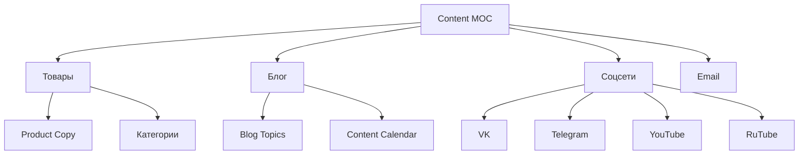

# ✍️ MOC Content Plan

> Контент-план: описания товаров, блог, соцсети

---

## 📂 Структура

---

## 📄 Страницы

### Товары
- [Product-Copy](05-Content-Plan/Product-Copy.md) — описания всех 6 SKU
- [Category-Texts](Category-Texts.md) — тексты категорий

### Блог
- [Blog-Topics](05-Content-Plan/Blog-Topics.md) — пул тем (50+)
- [Content-Calendar](05-Content-Plan/Content-Calendar.md) — календарь публикаций

### Соцсети
- [Social-Strategy](Social-Strategy.md) — стратегия SMM
- [Content-Pillars](05-Content-Plan/Content-Pillars.md) — 5 рубрик контента

### Прочее
- [Landing-Pages](Landing-Pages.md) — лендинги под рекламу
- [Email-Sequences](Email-Sequences.md) — цепочки писем

---

## 🎯 Контентные цели

### Краткосрочно (1-3 мес)
- [ ] Заполнить описания 6 товаров (300+ слов каждый)
- [ ] Написать 10 SEO-статей
- [ ] Снять 3 видео-обзора
- [ ] Запустить VK и Telegram

### Среднесрочно (3-6 мес)
- [ ] 30 статей в блоге
- [ ] 10 видео на YouTube
- [ ] 100 постов в соцсетях
- [ ] Email-цепочки (приветствие, брошенная корзина)

### Долгосрочно (6-12 мес)
- [ ] 100+ статей
- [ ] 50+ видео
- [ ] SMM-контент ежедневно
- [ ] Подкаст (опционально)

---

## 📊 KPI контент-плана

| Метрика | Цель Q4 | Цель Q2 |
|---|---|---|
| Статей в блоге | 10 | 30 |
| Видео | 3 | 15 |
| Постов в соцсетях | 50 | 200 |
| Подписчиков (Telegram) | 100 | 500 |
| Подписчиков (VK) | 200 | 1 000 |
| Подписчиков email | 200 | 1 000 |
| Среднее время на блоге | 2 мин | 4 мин |
| Organic traffic | 200/мес | 1 000/мес |

---

## 🔗 Связанные MOC

- [../01-Project/MOC-Project](01-Project/MOC-Project.md)
- [../03-Research/MOC-Research](03-Research/MOC-Research.md)
- [../08-Marketing/MOC-Marketing](08-Marketing/MOC-Marketing.md)

---

[⬅ Главная](00-Inbox/README.md)