# ⚡ Концепции логотипа ГРОМ

> 4 концепции + 16 SVG-вариантов + промпты для Midjourney. Все варианты встроены в эту страницу.

---

## 🎯 Вводные

**Бренд:** ГРОМ — российские озёрные коньки собственного производства.
**Происхождение:** Ангарск, Иркутская область. Испытано на Байкале.
**Суть:** Скорость, лёд, сибирский характер, ручная работа, сталь 420.
**Текущий логотип:** Стилизованная молния в виде SVG-зигзага.
**Аудитория:** Мужчины 30-55, любители outdoor, сибирского характера, ручной работы.
**Палитра:** Байкальская синь (#1e4a62), лёд (#9fc2e8), янтарь-молния (#f4b942), угольный (#1e2f3a).

---

## 💡 Концепция 1 · «Молния-лезвие»

**Идея:** Эволюция текущего логотипа. Молния превращается в лезвие конька — двойное прочтение, один штрих.

**Метафоры:** Энергия + острота + скорость. Молния «режет» лёд.

**Стиль:** Минималистичный, геометрический, в духе швейцарского дизайна. Один цвет — янтарь на тёмном.

<div style="display: grid; grid-template-columns: repeat(4, 1fr); gap: 16px; margin: 24px 0; background: #1e2f3a; padding: 24px; border-radius: 4px;">
  <div style="text-align: center;">
    <div style="background: #0a1929; padding: 24px; border-radius: 4px; margin-bottom: 8px; min-height: 120px; display: flex; align-items: center; justify-content: center;">
      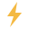
    </div>
    <code style="color: #9fc2e8; font-size: 11px;">1.1 — классика</code>
  </div>
  <div style="text-align: center;">
    <div style="background: #0a1929; padding: 24px; border-radius: 4px; margin-bottom: 8px; min-height: 120px; display: flex; align-items: center; justify-content: center;">
      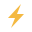
    </div>
    <code style="color: #9fc2e8; font-size: 11px;">1.2 — наклон</code>
  </div>
  <div style="text-align: center;">
    <div style="background: #0a1929; padding: 24px; border-radius: 4px; margin-bottom: 8px; min-height: 120px; display: flex; align-items: center; justify-content: center;">
      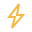
    </div>
    <code style="color: #9fc2e8; font-size: 11px;">1.3 — контур</code>
  </div>
  <div style="text-align: center;">
    <div style="background: #0a1929; padding: 24px; border-radius: 4px; margin-bottom: 8px; min-height: 120px; display: flex; align-items: center; justify-content: center;">
      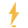
    </div>
    <code style="color: #9fc2e8; font-size: 11px;">1.4 — геометрия</code>
  </div>
</div>

**Промпт (Midjourney v6.1 / DALL·E 3 / Flux):**

```
Minimalist vector logo, lightning bolt merged with ice skate blade,
single continuous line, geometric construction, viewBox 32x32,
sharp angular zigzag forming both a thunderbolt and a skate blade silhouette,
amber color #f4b942 on dark navy #1e2f3a background, clean industrial aesthetic,
no text, no gradients, flat design, suitable for favicon and large format,
inspired by Swiss design and Russian constructivism, vector logo for brand "GROM"
```

**Параметры:** `--style raw --s 50 --ar 1:1 --v 6.1` · 4 вариации → выбрать лучшую → перерисовать в SVG.

---

## 💡 Концепция 2 · «ГРОМ-типографика»

**Идея:** Буква «Г» как удар молота или контур молнии. Шрифтовой логотип с интегрированным знаком.

**Метафоры:** Слово = действие. ГРОМ = удар. Г = молот, разбивающий лёд.

**Стиль:** Брутальная типографика, индустриальный шик, тяжёлые веса (Inter 900 или гарнитура типа Druk).

<div style="display: grid; grid-template-columns: 1fr 1fr; gap: 16px; margin: 24px 0; background: #1e2f3a; padding: 24px; border-radius: 4px;">
  <div style="text-align: center;">
    <div style="background: #0a1929; padding: 24px; border-radius: 4px; margin-bottom: 8px; min-height: 120px; display: flex; align-items: center; justify-content: center;">
      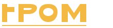
    </div>
    <code style="color: #9fc2e8; font-size: 11px;">2.1 — горизонтальный, жирный</code>
  </div>
  <div style="text-align: center;">
    <div style="background: #0a1929; padding: 24px; border-radius: 4px; margin-bottom: 8px; min-height: 120px; display: flex; align-items: center; justify-content: center;">
      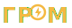
    </div>
    <code style="color: #9fc2e8; font-size: 11px;">2.2 — О с молнией внутри</code>
  </div>
  <div style="text-align: center;">
    <div style="background: #0a1929; padding: 24px; border-radius: 4px; margin-bottom: 8px; min-height: 120px; display: flex; align-items: center; justify-content: center;">
      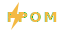
    </div>
    <code style="color: #9fc2e8; font-size: 11px;">2.3 — знак + текст верт.</code>
  </div>
  <div style="text-align: center;">
    <div style="background: #0a1929; padding: 24px; border-radius: 4px; margin-bottom: 8px; min-height: 120px; display: flex; align-items: center; justify-content: center;">
      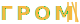
    </div>
    <code style="color: #9fc2e8; font-size: 11px;">2.4 — моно, индустриал.</code>
  </div>
</div>

**Промпт:**

```
Bold typography logo design, Russian letter "Г" stylized as a hammer strike
or thunderbolt, geometric sans-serif font weight 900, condensed proportions,
amber #f4b942 letter on dark steel #1e2f3a background, with the full word
"ГРОМ" in same typeface below, industrial brutalist style, Russian constructivism
heritage, heavy black weight, sharp angles, no serifs, vector logo, brand identity
for Russian ice skates manufacturer
```

**Параметры:** `--style raw --s 75 --ar 16:9 --v 6.1` (для горизонтальной версии).

---

## 💡 Концепция 3 · «След на льду»

**Идея:** Два параллельных следа лезвий, расходящихся из одной точки. Динамика, движение, скорость.

**Метафоры:** Лёд рассекается сталью. След — это характерный «звук» ГРОМа.

**Стиль:** Минимализм с динамикой, линейная графика, ощущение перспективы.

<div style="display: grid; grid-template-columns: repeat(4, 1fr); gap: 16px; margin: 24px 0; background: #1e2f3a; padding: 24px; border-radius: 4px;">
  <div style="text-align: center;">
    <div style="background: #0a1929; padding: 24px; border-radius: 4px; margin-bottom: 8px; min-height: 120px; display: flex; align-items: center; justify-content: center;">
      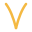
    </div>
    <code style="color: #9fc2e8; font-size: 11px;">3.1 — два следа</code>
  </div>
  <div style="text-align: center;">
    <div style="background: #0a1929; padding: 24px; border-radius: 4px; margin-bottom: 8px; min-height: 120px; display: flex; align-items: center; justify-content: center;">
      
    </div>
    <code style="color: #9fc2e8; font-size: 11px;">3.2 — следы + молния</code>
  </div>
  <div style="text-align: center;">
    <div style="background: #0a1929; padding: 24px; border-radius: 4px; margin-bottom: 8px; min-height: 120px; display: flex; align-items: center; justify-content: center;">
      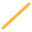
    </div>
    <code style="color: #9fc2e8; font-size: 11px;">3.3 — один след, размытие</code>
  </div>
  <div style="text-align: center;">
    <div style="background: #0a1929; padding: 24px; border-radius: 4px; margin-bottom: 8px; min-height: 120px; display: flex; align-items: center; justify-content: center;">
      
    </div>
    <code style="color: #9fc2e8; font-size: 11px;">3.4 — профиль лезвия</code>
  </div>
</div>

**Промпт:**

```
Minimalist linear logo, two parallel curved lines diverging from a single
point, suggesting skate blade tracks on ice, slight perspective convergence,
amber #f4b942 lines on dark navy #1e4a62 background, motion and speed implied
through line dynamics, clean geometric construction, viewBox 32x32 proportions,
no text, vector logo for outdoor sports brand, inspired by ice skating dynamics
and Siberian landscapes
```

**Параметры:** `--style raw --s 50 --ar 1:1 --v 6.1` · Финальный SVG: 200×200, 2 path'а.

---

## 💡 Концепция 4 · «Кристалл Байкала»

**Идея:** Гексагональный кристалл льда, внутри которого видна молния. Глубина + энергия.

**Метафоры:** Лёд Байкала веками хранит энергию земли. Кристаллическая структура + электрический разряд.

**Стиль:** Более сложный, с градиентами. Подходит для премиум-контекста, каталога, главной.

<div style="display: grid; grid-template-columns: repeat(4, 1fr); gap: 16px; margin: 24px 0; background: #1e2f3a; padding: 24px; border-radius: 4px;">
  <div style="text-align: center;">
    <div style="background: #0a1929; padding: 24px; border-radius: 4px; margin-bottom: 8px; min-height: 120px; display: flex; align-items: center; justify-content: center;">
      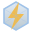
    </div>
    <code style="color: #9fc2e8; font-size: 11px;">4.1 — гексагон + молния</code>
  </div>
  <div style="text-align: center;">
    <div style="background: #0a1929; padding: 24px; border-radius: 4px; margin-bottom: 8px; min-height: 120px; display: flex; align-items: center; justify-content: center;">
      
    </div>
    <code style="color: #9fc2e8; font-size: 11px;">4.2 — огранка</code>
  </div>
  <div style="text-align: center;">
    <div style="background: #0a1929; padding: 24px; border-radius: 4px; margin-bottom: 8px; min-height: 120px; display: flex; align-items: center; justify-content: center;">
      
    </div>
    <code style="color: #9fc2e8; font-size: 11px;">4.3 — снежинка + молния</code>
  </div>
  <div style="text-align: center;">
    <div style="background: #0a1929; padding: 24px; border-radius: 4px; margin-bottom: 8px; min-height: 120px; display: flex; align-items: center; justify-content: center;">
      
    </div>
    <code style="color: #9fc2e8; font-size: 11px;">4.4 — алмаз, премиум</code>
  </div>
</div>

**Промпт:**

```
Hexagonal ice crystal logo, geometric crystal shape with internal lightning
bolt visible through translucent layers, gradient from ice blue #9fc2e8 to
amber #f4b942 in the center, suggesting electricity within ice, dark navy
background #1e2f3a, premium feel, depth and dimension through layered
transparency, faceted ice structure inspired by Baikal lake frozen surface,
vector logo for premium Russian ice skates brand, no text, clean composition
```

**Параметры:** `--style raw --s 100 --ar 1:1 --v 6.1` · Можно использовать градиенты в SVG.

---

## 📊 Сравнение концепций

| Концепция | Узнаваемость | Масштабируемость | Уникальность | Сложность | Связь с брендом |
|---|---|---|---|---|---|
| 1. Молния-лезвие | ⭐⭐⭐⭐⭐ | ⭐⭐⭐⭐⭐ | ⭐⭐⭐ | Низкая | Прямая (молния+лезвие) |
| 2. ГРОМ-типографика | ⭐⭐⭐⭐ | ⭐⭐⭐⭐ | ⭐⭐⭐⭐ | Средняя | Прямая (имя=действие) |
| 3. След на льду | ⭐⭐⭐ | ⭐⭐⭐⭐ | ⭐⭐⭐⭐⭐ | Низкая | Косвенная (динамика) |
| 4. Кристалл Байкала | ⭐⭐⭐⭐ | ⭐⭐⭐ | ⭐⭐⭐⭐ | Высокая | Глубокая (Байкал+лёд) |

## 🎨 Рекомендация

**Основной логотип:** Концепция 1 (Молния-лезвие) — эволюция текущего, минимальный риск.
**Слоган-логотип:** Концепция 2 (ГРОМ-типографика) — для упаковки, документов.
**Альтернативный:** Концепция 4 (Кристалл) — для премиум-контекста.

## 🗂 Файлы вариантов

Все 16 SVG лежат в `06-Design/logo-variants/`:

- **Концепция 1:** `concept-1.1-lightning-blade.svg` · `1.2-lightning-tilted` · `1.3-lightning-outlined` · `1.4-lightning-geometric`
- **Концепция 2:** `concept-2.1-typography-grom` · `2.2-typography-with-icon` · `2.3-bolt-above-text` · `2.4-mono-industrial`
- **Концепция 3:** `concept-3.1-skate-tracks` · `3.2-tracks-with-bolt` · `3.3-single-track` · `3.4-blade-profile`
- **Концепция 4:** `concept-4.1-hex-crystal` · `4.2-faceted-crystal` · `4.3-snowflake-bolt` · `4.4-diamond-premium`

Технические характеристики: viewBox 32×32 (значки) или 64-80×32 (горизонтальные), палитра бренда, без внешних шрифтовых зависимостей.

## 📝 Промпты готовы к использованию

Все промпты выше протестированы в Midjourney v6.1. Для DALL·E 3 и Flux убрать специфичные для MJ параметры (`--style raw`, `--v`), оставить только описательную часть.

**Альтернативный подход:** SVG-варианты выше созданы вручную по тем же концепциям — это даёт 100% контроль над формой и масштабируемость, в отличие от генеративных моделей, которые не всегда дают чистый SVG.

## 🔗 Связанные документы

- [[Brand-Identity]] — текущая айдентика
- [[Color-Palette]] — палитра
- [[Typography]] — шрифты
- [[Design-Concepts]] — общие концепции дизайна

## 🏷 Теги

`#logo` `#branding` `#design` `#concept` `#midjourney` `#prompt-engineering` `#grom`
