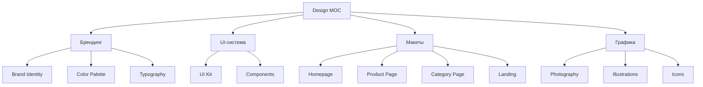

# 🎨 MOC Design

> Дизайн-система, макеты, айдентика

---

## 📂 Структура

---

## 📄 Страницы

### Брендинг
- [Brand-Identity](Brand-Identity.md) — айдентика
- [Logo-Concepts](Logo-Concepts.md) — 4 концепции логотипа + 16 SVG-вариантов
- [Color-Palette](Color-Palette.md) — цвета
- [Typography](Typography.md) — шрифты
- [Brand-Voice](Brand-Voice.md) — голос бренда

### UI
- [UI-Kit](UI-Kit.md) — компоненты
- [Buttons](Buttons.md) — кнопки
- [Forms](Forms.md) — формы
- [Cards](Cards.md) — карточки
- [Navigation](Navigation.md) — навигация

### Макеты
- [Homepage-Layout](Homepage-Layout.md) — главная
- [Product-Page-Layout](Product-Page-Layout.md) — карточка
- [Category-Page-Layout](Category-Page-Layout.md) — каталог
- [Landing-Layout](Landing-Layout.md) — лендинг

### Графика
- [Photography-Guidelines](Photography-Guidelines.md) — фото-гайдлайн
- [Iconography](Iconography.md) — иконки
- [Illustrations](Illustrations.md) — иллюстрации

---

## 🎨 Принципы дизайна

### 1. Mobile-first
- Начинаем с мобильного дизайна
- Затем десктоп
- Планшет — в конце

### 2. Современный минимализм
- Много воздуха (white space)
- Чёткая типографика
- Лаконичные формы
- Акцентный цвет

### 3. Байкальская эстетика
- Холодные тона (лёд)
- Глубокие синие (вода)
- Тёплый акцент (янтарь/солнце)
- Текстуры льда и снега

### 4. Сибирский характер
- Без гламура
- Честный и прочный
- Мощный, но не агрессивный

---

## 🔗 Связанные MOC

- [../01-Project/MOC-Project](../01-Project/MOC-Project.md)
- [../03-Research/Brand-Platform](../03-Research/Brand-Platform.md)
- [../06-Design/Brand-Identity](Brand-Identity.md)
- [../07-Technical/MOC-Tech](../07-Technical/MOC-Tech.md)

---

[⬅ Главная](../00-Inbox/README.md)