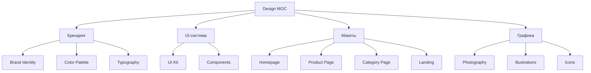

# 🎨 MOC Design

> Дизайн-система, макеты, айдентика

---

## 📂 Структура

---

## 📄 Страницы

### Брендинг
- [[Brand-Identity]] — айдентика
- [[Color-Palette]] — цвета
- [[Typography]] — шрифты
- [[Logo-Versions]] — версии логотипа
- [[Brand-Voice]] — голос бренда

### UI
- [[UI-Kit]] — компоненты
- [[Buttons]] — кнопки
- [[Forms]] — формы
- [[Cards]] — карточки
- [[Navigation]] — навигация

### Макеты
- [[Homepage-Layout]] — главная
- [[Product-Page-Layout]] — карточка
- [[Category-Page-Layout]] — каталог
- [[Landing-Layout]] — лендинг

### Графика
- [[Photography-Guidelines]] — фото-гайдлайн
- [[Iconography]] — иконки
- [[Illustrations]] — иллюстрации

---

## 🎨 Принципы дизайна

### 1. Mobile-first
- Начинаем с мобильного дизайна
- Затем десктоп
- Планшет — в конце

### 2. Современный минимализм
- Много воздуха (white space)
- Чёткая типографика
- Лаконичные формы
- Акцентный цвет

### 3. Байкальская эстетика
- Холодные тона (лёд)
- Глубокие синие (вода)
- Тёплый акцент (янтарь/солнце)
- Текстуры льда и снега

### 4. Сибирский характер
- Без гламура
- Честный и прочный
- Мощный, но не агрессивный

---

## 🔗 Связанные MOC

- [[../01-Project/MOC-Project]]
- [[../03-Research/Brand-Platform]]
- [[../06-Design/Brand-Identity]]
- [[../07-Technical/MOC-Tech]]

---

[[../README|⬅ Главная]]