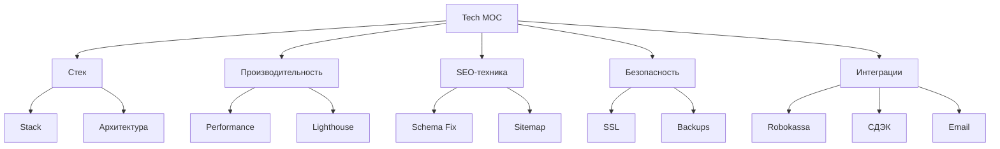

# ⚙️ MOC Tech

> Технический бэклог

---

## 📂 Структура

---

## 📄 Страницы

### Архитектура
- [Stack](Stack.md) — стек технологий
- [Hosting](Hosting.md) — хостинг
- [Backup-Strategy](Backup-Strategy.md) — бэкапы

### Производительность
- [Performance](Performance.md) — оптимизация скорости
- [Image-Optimization](Image-Optimization.md) — оптимизация изображений
- [Caching](Caching.md) — кэширование

### SEO-техника
- [SEO-Tech](SEO-Tech.md) — техническое SEO
- [Schema-Fix](Schema-Fix.md) — фикс Schema.org
- [Sitemap-Robots](Sitemap-Robots.md) — sitemap и robots

### Безопасность
- [Security](Security.md) — меры безопасности
- [Backups](Backups.md) — резервное копирование

### Интеграции
- [Robokassa](Robokassa.md) — платёжная система
- [Delivery-Integration](Delivery-Integration.md) — доставка (СДЭК)
- [Email-Integration](Email-Integration.md) — email-сервис
- [Analytics-Setup](Analytics-Setup.md) — настройка аналитики

---

## 🔥 Приоритеты

### P0 (срочно)
1. Исправить Schema.org ошибки
2. Включить meta description
3. Исправить email
4. Поправить ссылки (обратный слэш)
5. Удалить дубль кнопки MAX

### P1 (до запуска)
6. Оптимизировать изображения
7. Включить кэширование
8. Настроить цели в Метрике
9. Настроить SSL
10. Настроить бэкапы

### P2 (развитие)
11. CDN для изображений
12. Service Worker (PWA)
13. AMP-версии для товаров

---

## 🔗 Связанные MOC

- [Аудит](../02-Audit/MOC-Audit.md)
- [Проект](../01-Project/MOC-Project.md)

---

[⬅ Главная](../00-Inbox/README.md)