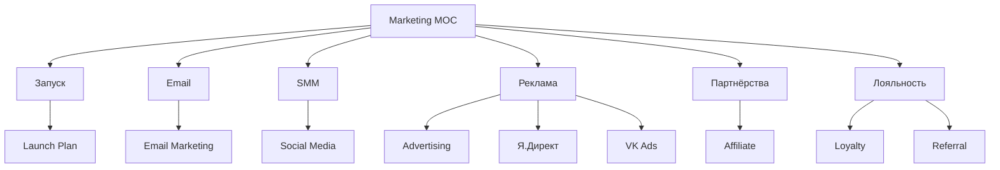

# 📣 MOC Marketing

> Маркетинговые активности

---

## 📂 Структура

---

## 📄 Страницы

### Запуск
- [[Launch-Plan]] — план запуска нового сайта

### Email
- [[Email-Marketing]] — email-стратегия
- [[Email-Sequences]] — цепочки писем

### SMM
- [[Social-Media]] — SMM-стратегия
- [[VK-Strategy]] — ВКонтакте
- [[Telegram-Strategy]] — Telegram
- [[YouTube-Strategy]] — YouTube/RuTube

### Реклама
- [[Advertising]] — рекламная стратегия
- [[Yandex-Direct]] — Яндекс.Директ
- [[VK-Ads]] — VK Реклама

### Партнёрства
- [[Partnerships]] — партнёрства
- [[Affiliate-Program]] — партнёрская программа

### Лояльность
- [[Loyalty-Program]] — программа лояльности
- [[Referral-Program]] — реферальная программа

---

## 🎯 Маркетинговые цели

### Q3 2026 (запуск)
- 100 подписчиков email
- 500 подписчиков VK
- 200 подписчиков Telegram
- 100 заказов
- 500 000 ₽ выручки

### Q4 2026 (рост)
- 500 подписчиков email
- 2 000 подписчиков VK
- 1 000 подписчиков Telegram
- 300 заказов
- 2 000 000 ₽ выручки

### Q1 2027 (масштабирование)
- 2 000 подписчиков email
- 5 000 подписчиков VK
- 3 000 подписчиков Telegram
- 1 000 заказов
- 7 500 000 ₽ выручки

---

## 💰 Бюджет на маркетинг

### Ежемесячный
| Канал | Бюджет | Ожидаемый ROI |
|---|---|---|
| Контент (SEO, блог) | 30 000 ₽ | долгосрочный |
| Email-маркетинг | 5 000 ₽ | 5-10x |
| SMM | 20 000 ₽ | бренд |
| Я.Директ | 50 000 ₽ | 3-5x |
| VK Ads | 30 000 ₽ | 2-4x |
| **Итого** | **135 000 ₽/мес** | **3-5x** |

### Годовой
- **1 620 000 ₽**
- **Ожидаемая выручка:** 7 000 000 ₽
- **ROI:** ~330%

---

## 📊 KPI маркетинга

| Метрика | Цель Q4 |
|---|---|
| Трафик на сайт | 3 000 уник/мес |
| Конверсия | 3% |
| CPO (стоимость заказа) | < 1 500 ₽ |
| CAC (стоимость клиента) | < 2 000 ₽ |
| LTV (пожизненная ценность) | > 15 000 ₽ |
| Email Open Rate | > 25% |
| Email CTR | > 5% |
| VK Engagement | > 5% |
| Telegram Reach | > 30% |

---

## 🔗 Связанные MOC

- [[../01-Project/MOC-Project]]
- [[../03-Research/MOC-Research]]
- [[../05-Content-Plan/MOC-Content]]

---

[[../README|⬅ Главная]]