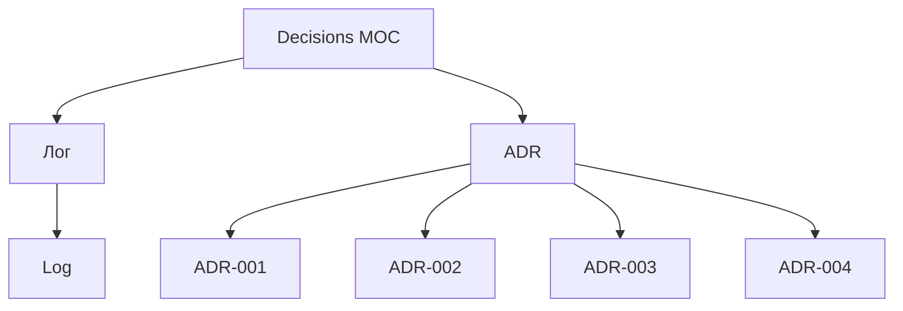

# ✅ MOC Decisions

> Архитектурные и стратегические решения

---

## 📂 Структура

---

## 📄 Страницы

### Все ADR
- [Log](Log.md) — лог всех решений
- [ADR-001](ADR-001.md) — редизайн: новый стек vs доработка WP
- [ADR-002](ADR-002.md) — разделение бизнесов: 1 домен vs 2
- [ADR-003](ADR-003.md) — брендинг: новый логотип
- [ADR-004](ADR-004.md) — маркетплейсы: подключать или нет

---

## 🎯 Что такое ADR

**ADR** (Architecture Decision Record) — формат фиксации важных решений:

1. **Контекст** — почему решение нужно
2. **Варианты** — что рассматривали
3. **Решение** — что выбрали
4. **Последствия** — что это меняет

---

## 📋 Принципы принятия решений

### Какие решения фиксировать
- ✅ Архитектурные (стек, БД, хостинг)
- ✅ Стратегические (позиционирование, цены)
- ✅ Инвестиционные (логотип, реклама)
- ✅ Операционные (интеграции, партнёрства)

### Какие НЕ фиксировать
- ❌ Мелочи UI (цвет кнопки)
- ❌ Оперативные задачи (завтрак)
- ❌ Тактические решения (текст поста)

---

## 🔗 Связанные MOC

- [../01-Project/MOC-Project](../01-Project/MOC-Project.md)
- [../03-Research/MOC-Research](../03-Research/MOC-Research.md)
- [../06-Design/MOC-Design](../06-Design/MOC-Design.md)

---

[⬅ Главная](../00-Inbox/README.md)