# 🗺 Граф знаний

Эта база использует подход **MOC (Map of Content)** — каждый раздел имеет центральный файл-указатель:

## 📚 Главные MOC-узлы

```mermaid
graph TD
    README["README (главная)"]
    
    README --> A["00-Inbox/README"]
    README --> B["01-Project/MOC-Project"]
    README --> C["02-Audit/MOC-Audit"]
    README --> D["03-Research/MOC-Research"]
    README --> E["04-Competitors/MOC-Competitors"]
    README --> F["05-Content-Plan/MOC-Content"]
    README --> G["06-Design/MOC-Design"]
    README --> H["07-Technical/MOC-Tech"]
    README --> I["08-Marketing/MOC-Marketing"]
    README --> J["09-Decisions/MOC-Decisions"]
    README --> K["10-Templates/README"]
    
    B --> B1[Business-Model]
    B --> B2[Goals]
    
    C --> C1[Technical-Audit]
    C --> C2[UX-Audit]
    C --> C3[SEO-Audit]
    C --> C4[Content-Audit]
    C --> C5[Visual-Audit]
    C --> C6[Schema-Audit]
    C --> C7[Bugs-Баги]
    
    D --> D1[Target-Audience]
    D --> D2[Personas]
    D --> D3[Positioning]
    D --> D4[Brand-Platform]
    
    F --> F1[Product-Copy]
    F --> F2[Blog-Topics]
    F --> F3[Content-Calendar]
    
    G --> G1[Brand-Identity]
    G --> G2[Homepage-Layout]
    G --> G3[Product-Page-Layout]
    
    style README fill:#1e4a62,color:#fff
    style B fill:#f4b942
    style C fill:#f4b942
    style D fill:#f4b942
    style E fill:#f4b942
    style F fill:#f4b942
    style G fill:#f4b942
    style H fill:#f4b942
    style I fill:#f4b942
    style J fill:#f4b942
    style K fill:#f4b942
```

## 🔗 Связи между разделами

- **Аудит** → питает **Решения** (что чинить)
- **Решения** → определяют **Дизайн** и **Технику**
- **Исследования** → определяют **Контент** и **Маркетинг**
- **Контент-план** → реализуется через **Маркетинг**
- **Дизайн** → опирается на **Бренд-платформу**

[[README|⬅ Главная]]